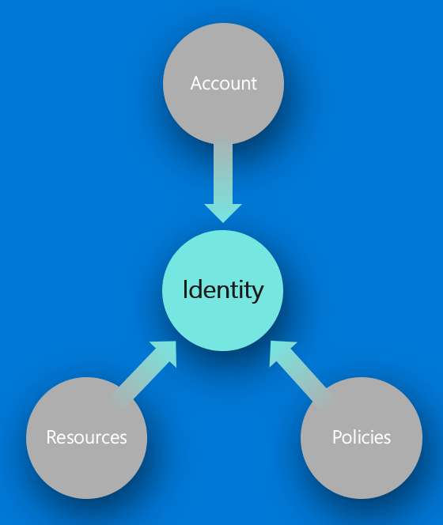

Secure cloud solution

Whiteboard design session student guide

May 2020

Information in this document, including URL and other Internet Web site references, is subject to change without notice. Unless otherwise noted, the example companies, organizations, products, domain names, e-mail addresses, logos, people, places, and events depicted herein are fictitious, and no association with any real company, organization, product, domain name, e-mail address, logo, person, place or event is intended or should be inferred. Complying with all applicable copyright laws is the responsibility of the user. Without limiting the rights under copyright, no part of this document may be reproduced, stored in or introduced into a retrieval system, or transmitted in any form or by any means (electronic, mechanical, photocopying, recording, or otherwise), or for any purpose, without the express written permission of Microsoft Corporation.

Microsoft may have patents, patent applications, trademarks, copyrights, or other intellectual property rights covering subject matter in this document. Except as expressly provided in any written license agreement from Microsoft, the furnishing of this document does not give you any license to these patents, trademarks, copyrights, or other intellectual property.

The names of manufacturers, products, or URLs are provided for informational purposes only and Microsoft makes no representations and warranties, either expressed, implied, or statutory, regarding these manufacturers or the use of the products with any Microsoft technologies. The inclusion of a manufacturer or product does not imply endorsement of Microsoft of the manufacturer or product. Links may be provided to third party sites. Such sites are not under the control of Microsoft and Microsoft is not responsible for the contents of any linked site or any link contained in a linked site, or any changes or updates to such sites. Microsoft is not responsible for webcasting or any other form of transmission received from any linked site. Microsoft is providing these links to you only as a convenience, and the inclusion of any link does not imply endorsement of Microsoft of the site or the products contained therein.

© 2020 Microsoft Corporation. All rights reserved.

Microsoft and the trademarks listed at <https://www.microsoft.com/legal/intellectualproperty/Trademarks/Usage/General.aspx> are trademarks of the Microsoft group of companies. All other trademarks are property of their respective owners.

**Contents**

<!-- TOC -->

- [Secure Cloud Solution Whiteboard Design Session Student Guide](#secure-cloud-solution-whiteboard-design-session-student-guide)
  - [Abstract and Learning Objectives](#abstract-and-learning-objectives)
  - [Step 1: Review the Customer Case Study](#step-1-review-the-customer-case-study)
    - [Customer Situation](#customer-situation)
    - [Customer Requirements](#customer-requirements)
    - [Customer Objections](#customer-objections)
    - [Key Design Considerations](#key-design-considerations)
    - [Contoso Current High-level Architecture](#contoso-current-high-level-architecture)
  - [Step 2: Design a Solution](#step-2-design-a-solution)
  - [Step 3: Present the Solution](#step-3-present-the-solution)
  - [Wrap-up](#wrap-up)
  - [Additional references](#additional-references)

<!-- /TOC -->
# Secure Cloud Solution Whiteboard Design Session Student Guide

## Abstract and Learning Objectives

In this whiteboard design session, you will learn how to implement different components of a secure cloud solution that integrates Active Directory, security policies that cover network security groups (NSGs) Shared Access Signatures (SAS), certificates and other application secrets. In this session you will learn secrets management and managed identities.

## Step 1: Review the Customer Case Study

**Outcome**

Analyze your customer's needs.

Timeframe: 15 minutes

Directions:  With all participants in the session, the facilitator/SME presents an overview of the customer case study along with technical tips.

1. Meet your table participants and trainer.

2. Read all of the directions for steps 1-3 in the student guide.

3. As a table team, review the following customer case study.

### Customer Situation
The renewable energy industry is growing fast!   

Contoso Solar Inc (Contoso) is a US Domestic commercial and residential solar installation and solar technology supply firm headquartered in the Pacific NorthWest, Unitest States.    

Established 2004, by founders Susan Johnson (CEO) and Darren Cross (CFO), Contoso have almost tripled in size, and have taken on a lot of new projects that even take them from a US Domestic only operation, to an international operation with the the closing of a lucrative project from neighboring British Columbia, Canada.   This has been a long and exciting road that involved a 36 month app-modernization effort coupled with a recent lift and shift to the cloud using Azure.  This was followed again by an 18 month re-design of their key applications to take advantage of serverless deployments to take advantage of swifter time to market to accomodate the massive grwoth enjoyed industry wide.  

Now that the overall cost to install solar has dropped by almost 70% and charging and conversion efficiency has increased, the business case for solar is very hard to ignore with overall unit installation price dropping - in many cases, with components converging on commodity status.  

Contoso currently has three satellite offices, each supporting installation, fulfullment, and distribution teams:  Portland, OR, Seattle, WA, and Austin, TX.   And, as a result of their success in the industry as well as achieving GDPR/CCPA compliance including a SOC 3 certification, they will be opening a new office in Vancouver, BC to tackle the new commercial business acquired in BC which is the installation of solar for a number of provincial buildings including schools, and transit stations.   

Susan Johnson (CEO) and Darren Cross (CFO) recognize the power of Azure public cloud. 
Contoso now has most of their key line of business applications, data storage, and analysis operations on Azure.   They use M365 and each satellite office has a small on-prem compute resource used to run specific scanning and installation kitting gear.  These domains are federated using AD Connect up to the primary AAD in Aure.  Contoso currently supports direct inbound and outbound data integration with established first tier solar technology manufacturers and component suppliers located globally as well as direct integration with shippers and payment providers. 

According to Chief Information Officer (CIO) Jessica Sams, Contoso's main concern is providing **robust application security** for it's own suppliers and customers while also providing an easy online experience for them. Contoso currently manages authentication via Azure Active Directory but wants to reconfigure to support a more robust solution for 3 major user experiences:

* **B2B** - Solar Manufacturer/Providers, including professional technical contributors such as: architectural, engineering, and regulatory/legal advisors from state and local entities.   One key workflow partner of this group is Contoso's own Commercial and Residential professional installer teams as there is heavy cross-team interaction during execution of project installations.  

* **B2C** - DYI Consumers purchasing components and services directly - either wholesale or retail, and/or opting in persistent account access enabling consumer access to extended offerings provided by Contoso Consumer Services including pre- and post- sales technical support, blog access, and access to technical events sponsored by the industry

* **OPS** - Internal employee groups such as C-Suite, HR, IT, Fulfillment, Installation Teams, Partner and Consumer Services, Sales and Marketing

With these use cases and the addtion of new infrastructure, locations, and employees, Contoso needs a solution that will provide reliable authentication but in addition, they require robust account management functionality, as well as the ability to secure and audit application configuration, and integration events. 

In particular, Suppliers accessing Contoso's Supplier Workflow and APIs should only have access to resources granted to those accounts.   One Supplier should not be able to interact with allocated resources of another supplier.   

Customers purchasing from the retail website should not be able to access wholesale prices, but an OPS Contoso Sales Account Manager should be able to see both retail and wholesale information for both B2B and B2C scenarios. 

This requires a system for access and authentication that can be centrally controlled by the Contoso OPS IT Team.   And this also means Contoso needs to focus on what an IDENTITY means to them in order to secure their cloud applications:

  

In addition to Authentication and Access management (Identity), Contoso wants to ensure that their backend infrastructure use as much of the Azure backbone as possible to include direct integrations with their cloud-based CRM and ERP systems.   And of course, any APIs and Web Applications need to be secure as well, with no application secrets stored in any config or application settings so they can be managed by the security team in accordance with their InfoSec Policy. 

**Contoso IT Security Team** 

The security team is lead by Jason Ming, VP of IT Operations, who reports to Jessica Sams (CIO/DPO), and manages all operational aspects of IT infrastructure including security. 

The security team is a small cross-functional unit of DevOps-aware individuals from other teams who participate by focusing on improving full-stack security.  This is a new approach, and timely since Contoso now has executive sponsorship to invest in the next push to improve the current system architecture.   

This team manages all security aspects for the applications and users at the company, from database access all the way down to card-key access readers, and as such they want to utilize Azure to simplify and reduce management overhead for Contoso's operations to ensure a lean, mean, secure configuration.

**Contoso Development Team** 

Contoso's Development Team is headed by David Stone, Lead System Integrations and Software Engineer 
Under David's leadership, the Contoso Develpment team Team have settled on Azure DevOps as their primary CI/CD platform and the run a tight ship with a clean backlog, using a Git-Flow   

Applications are deployed using Azure DevOps Pipelines with minimal 3rd party tool interaction with the exception of some common open source testing and verification/risk management libraries.  

Their typical sprint is 7 days with trunk releases (major, minor, and patch) in a blue-green configuration every Thursday.  

### Customer Requirements
The following requirements are a result of over a year of hard work assessing Contoso's IT security requirements in order to maintain compliance with certain certifications they need to work with global providers and provide for their customers, as well as transacting with first-tier payment providers and certifcation organizations. 

Fulfiliing these requirements using robust, repeatable capabilities is essential to Contoso's continued growth and success.   Failure in any one of these areas can jeaopardize the firm's ability to maintain their current level of compliance    

**Provide Unified Identity Management Throughout the Organization – Including Partners and Consumers**
Contoso has moved most of its primary applications and workflow into the cloud and uses M365 E5 licensing for their operations.   

**Existing Active Directory Domains**
There are 3 small local legacy AD V1 domains at each of the 3 satellite offices which are what is left of the old federated domain model after their primary move to the cloud.   

Most employees interact through AAD via the M365 tenant, but some will log into machines within the installation warehouses where compute is used drive some PLC controllers for installation kitting and automation, but those machines are simple Windows Server Standard 2016 installs and few in number.  

Each machine group is secured on domain by Windows Security Group membership, and the on-prem domains are already federated via Azure AD Connect to the parent M365 tenant.    DNS for www.contososolar.com is wired to the M365 tenant.

**Existing Azure Subscriptions**
Two additional Azure Subscriptions have trusted relationships with that same M365 tenant, one subscription for development, testing and another subscription for staging and production releases of their enterprise Applications and APIs.    

**Other Integrations**
Contoso uses Dynamics for their entire front operations including CRM and ERP functions as well as running an e-commerce purchase path directly through Dynamics.    

**Data Storage**
Contoso has migrated all of their operations, analytics and reporting datastores are on Azure SQL Database:

Given the environment, there are three valid authentication scenarios:  
- **B2B** - Partner Manufacturer/Suppliers should be able authenticate on invitation to Contoso's identity management using their work credentials via a guest configuration with Contoso's M365 tenant.   This will allow partners to authenticate and be authorized to interact with Contoso's application platforms as required either through direct Web or API interaction or via M365 UX, or perhaps even via Azure AD Application Proxy for older apps supporting SAML only.  

- **B2C** - DIY Retail Consumers should be able to use the ecommerce purchase path to purchase solar components with an anonymous cart purchase path.   Or they can create a persistent account with Contoso, using an email as username or using a social login from a valid Identity Provider, and save payment methods and view order status and order history along with sharing other social details if they desire.   This method gives them access to pre- and post- sales technical support as well as event and blog content.  

- **OPS** - Existing and New internal employees should be able to login with their assigned Active Directory Work Account from any valid secure location on any approved device.  Optionally this authentication flow may require multi-factor authorization (MFA).   Once authenticated, the user will experience single sign-on (SSO) behavior across enterprise applications and endpoints until they fully log out.

**Goal:** Provide an enterprise-ready solution to unify user and service account authentication, authorization, and management (provisioning).   This goal is essentially the foundational core of all the other requirements as it defines the identity management for users, LOB applications, and custom applications such as web apps, apis, service apps.  

**Provide Authorization Using Role Based Access Control for Custom Applications**
As per Contoso's Infosec and Data Handling Policies, there is an active Segregation of Duties (SOD) Matrix that defines a list of account roles and security groups within the company structure.   

*The desired outcome of all this effort:*  Employees and Guest Partners should have access only to the information they need to perform their duties.  

This requirement implies use of Role-based Access Control (RBAC) within the enterprise to match the SOD matrix.  OPS employees are allocated to roles and groups based on Employee Job Description and this will determine access to key resources, systems, and data.  

Listed below is a simple role classification for Contoso: 
- **Business Admin** – C-Suite, VPs
- **HR Admin** - HR Team 
- **Sales** - Sales and Marketing Teams
- **System Admin** – Configuration Team members, mapped to Azure Subscription Contributors.
- **Security Admin** – Security Team members, mapped to Azure Security Owners. 
- **Developer** – Development Team members 
- **Developer Contractor** – Development contractors 
- **Operations** – Office Operations, Installer Engineers, Fulfillment, and Technical Support 
- **External Partners** – B2B all external supplier and professional service partners interacting with Contoso applications 
- **External Consumer** – B2C all external consumers who have created accounts with Contoso for the Extended Payment, Service, and Technical Advisory Experience Contoso provides. 

**Goal:** Using the unified strategy you come up with above, apply the concept of Least Privilege and RBAC to configure roles to ensure that every user and service principle has the right level of permissions to the right principal, at the right time to execute – nothing more, nothing less.  Within the secure workflow of custom applications, apply RBAC checks based on roles found in access claims from the unified identity strategy to make decisions within the custom application workflow as to what actions the authenticated principal can take.   This secures endpoints that users and services can integrate with and ensures that custom applications are secured using the same unified strategy as the rest of the organization.

**Ensure Data Encryption - AT ALL TIMES (at rest and in motion)**

As Per Contoso's Infosec and Data Handling Policies, data will be encrypted at rest and in motion throughout the application stack, regardless of location and status and this includes during application synchronization (raw data file upload/download, application data synchronization, and API transactions).  

**Goal:**  Ensure all data within the organization is encrypted at all times and reduce complexity of application encryption by using pre-built middleware to encrypt/decrypt on the fly. 

**Provide Data and Resource Access Control based on RBAC and Identity**

As Per Contoso's Infosec and Data Handling Policies, data and resource access controls will be applied to ensure the right data is available to the right people at the right time.  

Access is controlled by role scoping, as well as filtering by robust unique identifier criteria.   Contoso also needs to audit certain activities and the audit process is tied to resources as well as roles.  

Listed below is a simple **data classification** of Contoso secure data: 

- **Business Critical** - Client Architectural, Engineering, Requirements, or Legal and Regulatory documents uploaded by architectural firms or by state and local regulatory entities 
- **Business Critical** - ERP, Transactional Data related to Wholesale and Retail Transactions, and Service Process data classified as **Business Critical ** by Contoso
- **Business Critical** - CRM, Sales Pipeline/Biz-Dev, Supplier, and Consultative Contributor, and Persistent Retail Customer profile data
- **Mission Critical** - Post process Analysis, Poduct Definitions, Product Catalog
- **PII** - Employee HR data to include data that is considered PII by GDPR/CCPA standards

**Goal:** Using RBAC role definitions, lock down access to data and resources within the applications to the appropriate roles.   Ensure access to data and resources are controlled based on permissions applied to roles.   This will simplify security management and reduce risk of improper access across the organization.  

**Provide Authorization Using Role Based Access Control for Custom Applications**

Custom applications should verify access and capabilities for user and service principals using the same unified identity strategy the rest of the organization uses where possible.    

Using the same strategy means access to the same roles defined in RBAC and this means a global role-based approach can be applied to the organization which reduces management complexity and overhead, as well as making the management of roles and assignment more centralized.    

**Goal:** Within the secure workflow of custom applications, apply RBAC checks based on roles found in access claims from the unified identity strategy to make decisions within the custom application workflow as to what actions the authenticated principal can take.   This secures endpoints that users and services can integrate with and ensures that custom applications are secured using the same unified strategy as the rest of the organization.

**Provide Robust Application Deployment to Improve Stability and Security**

For deployment, application reliability and security can be improved by using consistent development, verification, and deployment practices.  

Using a dedicated, secure pipeline build tool-chain as the official deployment source will reduce the probability of injecting security risks such as vulnerabilities due to poor code quality, lack of testing, or malicious intent, into Production. 

**Goal:** Use consistent deployment processes and practices to ensure stable and secure deployments.  

### Customer Objections

1. We are concerned that the addition of other AAD instances to support B2C and B2B guests will require us to recreate all of our accounts and reassign permissions

2. We are worried about applying RBAC because in the past it has been hard to ensure people get the right access

3. The Development Team is concerned that further constraining releases will slow down development 

4. The Development Team is also worried about the depth of refactoring required to ensure custom apps can verify actions to roles 

### Key Design Considerations

According to David Stone, Lead System Integrations and Software Engineer, Contoso operates mostly in North American West Coast. This means that for now, performance for multiple regions takes a back seat to the more emergent application and integdration security  concerns.  The IT Group has implemented minimal cloud-based HADR, but since Contoso is growing, their IT Group will revisit these topics in the near future after the security upfit is complete.  

Nearly all of the custom applications Contoso have deployed are ASP.NET Core Web Apps and APIs or .NET Core Daemon Apps.  This is a result of a massive refactoring and tool-chain consolitation campaign started last year, uplifting their custom applications from a jungle of legacy tools and languages to a common tool-chain and language set.   This effort resulted in more predictable delivery due to reduced complexity, faster development, and greatly reduced time to market. 

All front-end APIs and Web Apps are deployed to auto-scaled app service plans.   In the near future, the Application Architecture Team is considering converting to a CQRS architecture to address scale concerns for upcoming growth by using an event/messaging, or pub-sub design pattern. 

The overall design should provide a wholistic cloud security strategy extending security for existing integrations as well as setting the stage for current and future development.  

In terms of Secure Cloud Application requirements, a few things are clear:  
- Following Principle of Least Privilege, Developers should not have direct code-level access to production application secrets
- Applications need to be configured to authenticate with Azure services such as Azure SQL Database, and Azure Key Vault
- Client applications will need to authenticate discreet classes of users using a unified security approach - Contoso needs a unified strategy for authentication and authorization

**NOTE**

Locking down a Secure Cloud Application Strategy is the primary concern right now however, Contoso is growing - fast - so consideration for scale and performance should be included during design.

### Contoso Current High-level Architecture
  

## Step 2: Design a Solution 

**Goal:** Design a solution and prepare to present the solution to the target customer audience in a 15-minute chalk-talk format.

**Timeframe:** 60 minutes

**Directions:** With all participants at your table, answer the following questions and list the answers on a flip chart:

- **What customer business needs do you need to address with your solution?**

- **How would you design a Unified Identity Solution for Contoso that includes Contoso partners and customers?**
- **What are some methods to effectively migrate users for both the External Partners and Customers from existing user stores into the new Unified Identity Solution?**
- **How would you ensure data is encryption across the full stack for Contoso?** 
- **How would you design a solution where credential master keys (CMK) for data encrption, were managed by a regulated team such as in BYOK scenarios?** 
- **How would you control access to data, cloud resources, and LOB applications within the organization as well as reducing authorization management overhead?**
- **How would you ensure robust application security design across all stages of development from POC to deployment in Production?**
- **What methods can be used to abstract application secrets away from application configuration during development and deployment?**
- **What refactoring is required for custom applications to use the unified identity strategy?**
- **Who is your target audience and who are the decision makers within the organization?**
- **Who should you present this solution to?**
- **What are the benefits of your solution?**
- **Are there any customer requirements not addressed by your solution?**
- **Are there any major caveats the customer must consider on implementation?**
- **How does your design account for customer objectives and objections?**

## Step 3: Present the Solution

**Goal:**Prepare a 15-minute chalk-talk style presentation for the customer and present your solution to another table as the "target audience".

**Timeframe:** 30 minutes

**Directions:**

1. Pair with another table.

2. One table is the Microsoft team and the other table is the customer.

3. The Microsoft team presents their proposed solution to the customer.

4. The customer makes one of the objections from the list of objections.

5. The Microsoft team responds to the objection.

6. The customer team gives feedback to the Microsoft team.

7. Tables switch roles and repeat Steps 2-6.

##  Wrap-up 

**Timeframe:** 15 minutes

**Directions:** Tables reconvene with the larger group to hear the facilitator/SME share the preferred solution for the case study.

##  Additional references

|    |            |
|----------|:-------------:|
| **Description** | **Links** |
| Azure SQL Database TDE (BYOK)         | <https://docs.microsoft.com/en-us/azure/azure-sql/database/transparent-data-encryption-byok-configure> |
|TDE BYOK Process Overview |<https://docs.microsoft.com/en-us/azure/azure-sql/database/transparent-data-encryption-byok-overview>|
| Azure SQL Database Always Encrypted   | <https://docs.microsoft.com/en-us/azure/azure-sql/database/always-encrypted-certificate-store-configure> |
| Azure SQL Database AE Colum Master Key Overview |<https://docs.microsoft.com/en-us/sql/relational-databases/security/encryption/overview-of-key-management-for-always-encrypted>|
| Azure SQL Database AE Column Master Key Management| <https://docs.microsoft.com/en-us/sql/relational-databases/security/encryption/create-and-store-column-master-keys-always-encrypted> |
| Azure SQL Database Row Level Security | https://azure.microsoft.com/en-us/resources/videos/row-level-security-in-azure-sql-database/ |
| Azure Key Vault Developer's Guide     | <https://azure.microsoft.com/documentation/articles/key-vault-developers-guide/>|
| About Keys and Secrets                | <https://msdn.microsoft.com/library/dn903623.aspx> |
|Quickstart: Azure Key Vault client library for .NET(SDK v4)|<https://docs.microsoft.com/en-us/azure/key-vault/secrets/quick-create-net#setting-up>|
|Tutorial: Use a managed identity to connect Key Vault to an Azure Web App with .NET|<https://docs.microsoft.com/en-us/azure/key-vault/general/tutorial-net-create-vault-azure-web-app>|
| Azure API Management Overview         | <https://docs.microsoft.com/azure/api-management/api-management-key-concepts> |
| Working with Azure Functions Proxies  | <https://docs.microsoft.com/azure/azure-functions/functions-proxies> |
| Git Trunk-based Development|https://trunkbaseddevelopment.com/|
| Register an Application with MID V2   | <https://docs.microsoft.com/en-us/graph/auth-register-app-v2>|
| Microsoft Identity Platform and OpenID Connect|<https://docs.microsoft.com/en-us/azure/active-directory/develop/v2-protocols-oidc>|
| Azure MIP-MSAL Authentication Flows       | <https://docs.microsoft.com/en-us/azure/active-directory/develop/msal-authentication-flows>|
| MIP Permissions and Consent |<https://docs.microsoft.com/en-us/azure/active-directory/develop/v2-permissions-and-consent>|
| Microsoft Identity Platform Best Practice Checklist|<https://docs.microsoft.com/en-us/azure/active-directory/develop/identity-platform-integration-checklist>|
| What is Azure Active Directory B2B? | <https://docs.microsoft.com/en-us/azure/active-directory/b2b/>  |
| Azure Active Directory B2B documentation | <https://docs.microsoft.com/en-us/azure/active-directory/b2b/>  |
| Azure Active Directory B2C Technical Overview|<https://docs.microsoft.com/en-us/azure/active-directory-b2c/technical-overview>|
| Azure Active Directory B2C documentation | <https://docs.microsoft.com/en-us/azure/active-directory-b2c/>  |
| Azure Active Directoyr B2C User Migration |<https://docs.microsoft.com/en-us/azure/active-directory-b2c/user-migration>|
| Manage Azure AD B2C User Accounts with Microsoft Graph |<https://docs.microsoft.com/en-us/azure/active-directory-b2c/manage-user-accounts-graph-api>|
| What is hybrid identity with Azure Active Directory? | <https://docs.microsoft.com/en-us/azure/active-directory/hybrid/whatis-hybrid-identity>  |
| Choose the right authentication method for your Azure Active Directory hybrid identity solution | <https://docs.microsoft.com/en-us/azure/security/fundamentals/choose-ad-authn>  |
| Azure AD Connect sync: Understand and customize synchronization |  <https://docs.microsoft.com/en-us/azure/active-directory/hybrid/how-to-connect-sync-whatis> |
| Buy a custom domain name for Azure App Service | <https://docs.microsoft.com/en-us/azure/app-service/manage-custom-dns-buy-domain>  |
| AD Conditional Access Overview | <https://docs.microsoft.com/en-us/azure/active-directory/conditional-access/overview>  |
| AD Identity Protection|<https://docs.microsoft.com/en-us/azure/active-directory/identity-protection/overview-identity-protection>|
