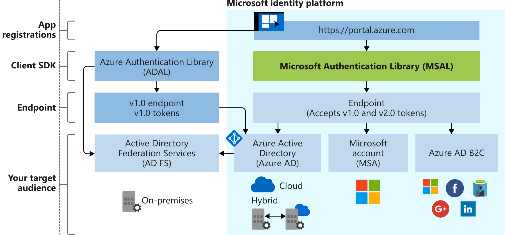
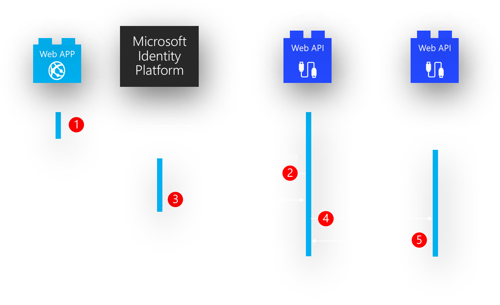

Secure Cloud Solutions

Whiteboard Design Session Trainer Guide

May 2020

Information in this document, including URL and other Internet Web site references, is subject to change without notice. Unless otherwise noted, the example companies, organizations, products, domain names, e-mail addresses, logos, people, places, and events depicted herein are fictitious, and no association with any real company, organization, product, domain name, e-mail address, logo, person, place or event is intended or should be inferred. Complying with all applicable copyright laws is the responsibility of the user. Without limiting the rights under copyright, no part of this document may be reproduced, stored in or introduced into a retrieval system, or transmitted in any form or by any means (electronic, mechanical, photocopying, recording, or otherwise), or for any purpose, without the express written permission of Microsoft Corporation.

Microsoft may have patents, patent applications, trademarks, copyrights, or other intellectual property rights covering subject matter in this document. Except as expressly provided in any written license agreement from Microsoft, the furnishing of this document does not give you any license to these patents, trademarks, copyrights, or other intellectual property.

The names of manufacturers, products, or URLs are provided for informational purposes only and Microsoft makes no representations and warranties, either expressed, implied, or statutory, regarding these manufacturers or the use of the products with any Microsoft technologies. The inclusion of a manufacturer or product does not imply endorsement of Microsoft of the manufacturer or product. Links may be provided to third party sites. Such sites are not under the control of Microsoft and Microsoft is not responsible for the contents of any linked site or any link contained in a linked site, or any changes or updates to such sites. Microsoft is not responsible for webcasting or any other form of transmission received from any linked site. Microsoft is providing these links to you only as a convenience, and the inclusion of any link does not imply endorsement of Microsoft of the site or the products contained therein.

© 2020 Microsoft Corporation. All rights reserved.

Microsoft and the trademarks listed at <https://www.microsoft.com/en-us/legal/intellectualproperty/Trademarks/Usage/General.aspx> are trademarks of the Microsoft group of companies. All other trademarks are property of their respective owners.

**Contents**

<!-- TOC -->

- [Trainer Information](#trainer-information)
  - [Role of the Trainer](#role-of-the-trainer)
  - [Whiteboard Design Session Flow](#whiteboard-design-session-flow)
  - [Before the whiteboard design session: How to prepare](#before-the-whiteboard-design-session-how-to-prepare)
  - [During the whiteboard design session: Tips for an effective whiteboard design session](#during-the-whiteboard-design-session-tips-for-an-effective-whiteboard-design-session)
- [Secure Cloud Solution Whiteboard Design Session Student Guide](#secure-cloud-solution-whiteboard-design-session-student-guide)
  - [Abstract and Learning Objectives](#abstract-and-learning-objectives)
  - [Step 1: Review the Customer Case Study](#step-1-review-the-customer-case-study)
    - [Customer Scenario](#customer-scenario)
    - [Customer Requirements](#customer-requirements)
    - [Customer Objections](#customer-objections)
    - [Key Design Considerations](#key-design-considerations)
    - [Infographic for common scenarios](#infographic-for-common-scenarios)
- [INFOGRAPHIC HERE](#infographic-here)
  - [Step 2: Design a Solution](#step-2-design-a-solution)
  - [Step 3: Present the Solution](#step-3-present-the-solution)
  - [Wrap-up](#wrap-up)
  - [Additional references](#additional-references)
- [Secure Cloud Solution Whiteboard Design Session Trainer Guide](#secure-cloud-solution-whiteboard-design-session-trainer-guide)
  - [Step 1: Review the customer case study](#step-1-review-the-customer-case-study-1)
  - [Step 2: Design a proof of concept solution](#step-2-design-a-proof-of-concept-solution)
  - [Step 3: Present the solution](#step-3-present-the-solution-1)
  - [Wrap-up](#wrap-up-1)
  - [Preferred target audience](#preferred-target-audience)
  - [Preferred solution](#preferred-solution)
    - [Requirement Summary](#requirement-summary)
- [DBUG DBUG DBUG DBUG DBUG DBUG DBUG DBUG DBUG DBUG DBUG DBUG DBUG DBUG DBUG DBUG DBUG DBUG DBUG DBUG DBUG DBUG](#dbug-dbug-dbug-dbug-dbug-dbug-dbug-dbug-dbug-dbug-dbug-dbug-dbug-dbug-dbug-dbug-dbug-dbug-dbug-dbug-dbug-dbug)
- [DBUG DBUG DBUG DBUG DBUG DBUG DBUG DBUG DBUG DBUG DBUG DBUG DBUG DBUG DBUG DBUG DBUG DBUG DBUG DBUG DBUG DBUG](#dbug-dbug-dbug-dbug-dbug-dbug-dbug-dbug-dbug-dbug-dbug-dbug-dbug-dbug-dbug-dbug-dbug-dbug-dbug-dbug-dbug-dbug-1)
  - [Customer quote (to be read back to the attendees at the end)](#customer-quote-to-be-read-back-to-the-attendees-at-the-end)

<!-- /TOC -->

# Trainer Information

Thank you for taking time to support the whiteboard design sessions as a trainer!

## Role of the Trainer

An amazing trainer:

- Creates a safe environment in which learning can take place.

- Stimulates the participant's thinking.

- Involves the participant in the learning process.

- Manages the learning process (on time, on topic, and adjusting to benefit participants).

- Ensures individual participant accountability.

- Ties it all together for the participant.

- Provides insight and experience to the learning process.

- Effectively leads the whiteboard design session discussion.

- Monitors quality and appropriateness of participant deliverables.

- Effectively leads the feedback process.

## Whiteboard Design Session Flow

Each whiteboard design session uses the following flow:

**Step 1: Review the customer case study (15 minutes)**

**Outcome**

Analyze your customer's needs.

- Customer's background, situation, needs and technical requirements

- Current customer infrastructure and architecture

- Potential issues, objectives and blockers

**Step 2: Design a proof of concept solution (60 minutes)**

**Outcome**

Design a solution and prepare to present the solution to the target customer audience in a 15-minute chalk-talk format.

- Determine your target customer audience.

- Determine customer's business needs to address your solution.

- Design and diagram your solution.

- Prepare to present your solution.

**Step 3: Present the solution (30 minutes)**

**Outcome**

Present solution to your customer:

- Present solution

- Respond to customer objections

- Receive feedback

**Wrap-up (15 minutes)**

- Review preferred solution

## Before the whiteboard design session: How to prepare

Before conducting your first whiteboard design session:

- Read the Student guide (including the case study) and Trainer guide.

- Become familiar with all key points and activities.

- Plan the point you want to stress, which questions you want to drive, transitions, and be ready to answer questions.

- Prior to the whiteboard design session, discuss the case study to pick up more ideas.

- Make notes for later.

## During the whiteboard design session: Tips for an effective whiteboard design session

**Refer to the Trainer guide** to stay on track and observe the timings.

**Do not expect to memorize every detail** of the whiteboard design session.

When participants are doing activities, you can **look ahead to refresh your memory**.

- **Adjust activity and whiteboard design session pace** as needed to allow time for presenting, feedback, and sharing.

- **Add examples, points, and stories** from your own experience. Think about stories you can share that help you make your points clearly and effectively.

- **Consider creating a "parking lot"** to record issues or questions raised that are outside the scope of the whiteboard design session or can be answered later. Decide how you will address these issues, so you can acknowledge them without being derailed by them.

***Have fun**! Encourage participants to have fun and share!*

**Involve your participants.** Talk and share your knowledge but always involve your participants, even while you are the one speaking.

**Ask questions** and get them to share to fully involve your group in the learning process.

**Ask first**, whenever possible. Before launching into a topic, learn your audience's opinions about it and experiences with it. Asking first enables you to assess their level of knowledge and experience, and leaves them more open to what you are presenting.

**Wait for responses**. If you ask a question such as, "What's your experience with (fill in the blank)?" then wait. Do not be afraid of a little silence. If you leap into the silence, your participants will feel you are not serious about involving them and will become passive. Give participants a chance to think, and if no one answers, patiently ask again. You will usually get a response.

# Secure Cloud Solution Whiteboard Design Session Student Guide

## Abstract and Learning Objectives

In this whiteboard design session, you will learn how to implement different components of a secure cloud solution that integrates Active Directory, security policies that cover network security groups (NSGs) Shared Access Signatures (SAS), certificates and other application secrets. In this session you will learn secrets management and managed identities.

## Step 1: Review the Customer Case Study

**Outcome**

Analyze your customer's needs.

Timeframe: 15 minutes

Directions:  With all participants in the session, the facilitator/SME presents an overview of the customer case study along with technical tips.

1. Meet your table participants and trainer.

2. Read all of the directions for steps 1-3 in the student guide.

3. As a table team, review the following customer case study.

### Customer Situation
The renewable energy industry is growing fast!   

Contoso Solar Inc (Contoso) is a US Domestic commercial and residential solar installation and solar technology supply firm headquartered in the Pacific NorthWest, Unitest States.    

Established 2004, by founders Susan Johnson (CEO) and Darren Cross (CFO), Contoso have almost tripled in size, and have taken on a lot of new projects that even take them from a US Domestic only operation, to an international operation with the the closing of a lucrative project from neighboring British Columbia, Canada.   This has been a long and exciting road that involved a 36 month app-modernization effort coupled with a recent lift and shift to the cloud using Azure.  This was followed again by an 18 month re-design of their key applications to take advantage of serverless deployments to take advantage of swifter time to market to accomodate the massive grwoth enjoyed industry wide.  

Now that the overall cost to install solar has dropped by almost 70% and charging and conversion efficiency has increased, the business case for solar is very hard to ignore with overall unit installation price dropping - in many cases, with components converging on commodity status.  

Contoso currently has three satellite offices, each supporting installation, fulfullment, and distribution teams:  Portland, OR, Seattle, WA, and Austin, TX.   And, as a result of their success in the industry as well as achieving GDPR/CCPA compliance including a SOC 3 certification, they will be opening a new office in Vancouver, BC to tackle the new commercial business acquired in BC which is the installation of solar for a number of provincial buildings including schools, and transit stations.   

Susan Johnson (CEO) and Darren Cross (CFO) recognize the power of Azure public cloud. 
Contoso now has most of their key line of business applications, data storage, and analysis operations on Azure.   They use M365 and each satellite office has a small on-prem compute resource used to run specific scanning and installation kitting gear.  These domains are federated using AD Connect up to the primary AAD in Aure.  Contoso currently supports direct inbound and outbound data integration with established first tier solar technology manufacturers and component suppliers located globally as well as direct integration with shippers and payment providers. 

According to Chief Information Officer (CIO) Jessica Sams, Contoso's main concern is providing **robust application security** for it's own suppliers and customers while also providing an easy online experience for them. Contoso currently manages authentication via Azure Active Directory but wants to reconfigure to support a more robust solution for 3 major user experiences:

* **B2B** - Solar Manufacturer/Providers, including professional technical contributors such as: architectural, engineering, and regulatory/legal advisors from state and local entities.   One key workflow partner of this group is Contoso's own Commercial and Residential professional installer teams as there is heavy cross-team interaction during execution of project installations.  

* **B2C** - DYI Consumers purchasing components and services directly - either wholesale or retail, and/or opting in persistent account access enabling consumer access to extended offerings provided by Contoso Consumer Services including pre- and post- sales technical support, blog access, and access to technical events sponsored by the industry

* **OPS** - Internal employee groups such as C-Suite, HR, IT, Fulfillment, Installation Teams, Partner and Consumer Services, Sales and Marketing

With these use cases and the addtion of new infrastructure, locations, and employees, Contoso needs a solution that will provide reliable authentication but in addition, they require robust account management functionality, as well as the ability to secure and audit application configuration, and integration events. 

In particular, Suppliers accessing Contoso's Supplier Workflow and APIs should only have access to resources granted to those accounts.   One Supplier should not be able to interact with allocated resources of another supplier.   

Customers purchasing from the retail website should not be able to access wholesale prices, but an OPS Contoso Sales Account Manager should be able to see both retail and wholesale information for both B2B and B2C scenarios. 

This requires a system for access and authentication that can be centrally controlled by the Contoso OPS IT Team.

In addition to Authentication and Access management (Identity), Contoso wants to ensure that their backend infrastructure use as much of the Azure backbone as possible to include direct integrations with their cloud-based CRM and ERP systems.   And of course, any APIs and Web Applications need to be secure as well, with no application secrets stored in any config or application settings so they can be managed by the security team in accordance with their InfoSec Policy. 

**Contoso IT Security Team** 

The security team is lead by Jason Ming, VP of IT Operations, who reports to Jessica Sams (CIO/DPO), and manages all operational aspects of IT infrastructure including security. 

The security team is a small cross-functional unit of DevOps-aware individuals from other teams who participate by focusing on improving full-stack security.  This is a new approach, and timely since Contoso now has executive sponsorship to invest in the next push to improve the current system architecture.   

This team manages all security aspects for the applications and users at the company, from database access all the way down to card-key access readers, and as such they want to utilize Azure to simplify and reduce management overhead for Contoso's operations to ensure a lean, mean, secure configuration.

**Contoso Development Team** 

Contoso's Development Team is headed by David Stone, Lead System Integrations and Software Engineer 
Under David's leadership, the Contoso Develpment team Team have settled on Azure DevOps as their primary CI/CD platform and the run a tight ship with a clean backlog, using a Git-Flow   

Applications are deployed using Azure DevOps Pipelines with minimal 3rd party tool interaction with the exception of some common open source testing and verification/risk management libraries.  

Their typical sprint is 7 days with trunk releases (major, minor, and patch) in a blue-green configuration every Thursday.  

### Customer Requirements
The following requirements are a result of over a year of hard work assessing Contoso's IT security requirements in order to maintain compliance with certain certifications they need to work with global providers and provide for their customers, as well as transacting with first-tier payment providers and certifcation organizations. 

Fulfiliing these requirements using robust, repeatable capabilities is essential to Contoso's continued growth and success.   Failure in any one of these areas can jeaopardize the firm's ability to maintain their current level of compliance    

**Provide Unified Identity Management Throughout the Organization – Including Partners and Consumers**
Contoso has moved most of its primary applications and workflow into the cloud and uses M365 E5 licensing for their operations.   

**Existing Active Directory Domains**
There are 3 small local legacy AD V1 domains at each of the 3 satellite offices which are what is left of the old federated domain model after their primary move to the cloud.   Most employees interact through AAD via the M365 tenant, but some will log into machines within the installation warehouses where compute is used drive some PLC controllers for installation kitting and automation, but those machines are simple Windows Server Standard 2016 installs and few in number.  Each machine group is secured on domain by Windows Security Group membership, and the on-prem domains are already federated via Azure AD Connect to the parent M365 tenant.    DNS for www.contososolar.com is wired to the M365 tenant.

**Existing Azure Subscriptions**
Two additional Azure Subscriptions have trusted relationships with that same M365 tenant, one subscription for development, testing and another subscription for staging and production releases of their enterprise Applications and APIs.    

**Other Integrations**
Contoso uses Dynamics for their entire front operations including CRM and ERP functions as well as running an e-commerce purchase path directly through Dynamics.    

**Data Storage**
Contoso has migrated all of their operations, analytics and reporting datastores are on Azure SQL Database:

Given the environment, there are three valid authentication scenarios:  
•	B2B - DIY Retail Consumers should be able to use the ecommerce purchase path to purchase solar components with an anonymous cart purchase path.   Or they can create a persistent account with Contoso, using an email as username or using a social login from a valid Identity Provider, and save payment methods and view order status and order history along with sharing other social details if they desire.   This method gives them access to pre- and post- sales technical support as well as event and blog content.  
•	B2C - DIY Retail Consumers should be able to use the ecommerce purchase path to purchase solar components with an anonymous cart purchase path.   Or they can create a persistent account with Contoso, using an email as username or using a social login from a valid Identity Provider, and save payment methods and view order status and order history along with sharing other social details if they desire.   This method gives them access to pre- and post- sales technical support as well as event and blog content.  
•	OPS - Existing and New internal employees should be able to login with their assigned Active Directory Work Account from any valid secure location on any approved device.  Optionally this authentication flow may require multi-factor authorization (MFA).   Once authenticated, the user will experience single sign-on (SSO) behavior across enterprise applications and endpoints until they fully log out.

**Goal:** Provide an enterprise-ready solution to unify user and service account authentication, authorization, and management (provisioning).   This goal is essentially the foundational core of all the other requirements as it defines the identity management for users, LOB applications, and custom applications such as web apps, apis, service apps.  

**Provide Authorization Using Role Based Access Control for Custom Applications**
As per Contoso's Infosec and Data Handling Policies, there is an active Segregation of Duties (SOD) Matrix that defines a list of account roles and security groups within the company structure.   Employees should have access only to the information they need to perform their duties.  This requirement implies use of Role-based Access Control (RBAC) within the enterprise to match the SOD matrix.   
OPS employees are allocated to roles and groups based on Employee Job Description and this will determine access to key resources, systems, and data.  

Listed below is a simple role classification for Contoso: 
- **Business Admin** – C-Suite, VPs
- **HR Admin** - HR Team 
- **Sales** - Sales and Marketing Teams
- **System Admin** – Configuration Team members, mapped to Azure Subscription Contributors.
- **Security Admin** – Security Team members, mapped to Azure Security Owners. 
- **Developer** – Development Team members 
- **Developer Contractor** – Development contractors 
- **Operations** – Office Operations, Installer Engineers, Fulfillment, and Technical Support 
- **External Partners** – B2B all external supplier and professional service partners interacting with Contoso applications 
- **External Consumer** – B2C all external consumers who have created accounts with Contoso for the Extended Payment, Service, and Technical Advisory Experience Contoso provides. 

**Goal:** Using the unified strategy you come up with above, apply the concept of Least Privilege and RBAC to configure roles to ensure that every user and service principle has the right level of permissions to the right principal, at the right time to execute – nothing more, nothing less.  Within the secure workflow of custom applications, apply RBAC checks based on roles found in access claims from the unified identity strategy to make decisions within the custom application workflow as to what actions the authenticated principal can take.   This secures endpoints that users and services can integrate with and ensures that custom applications are secured using the same unified strategy as the rest of the organization.

**Ensure Data Encryption - AT ALL TIMES (at rest and in motion)**
As Per Contoso's Infosec and Data Handling Policies, data will be encrypted at rest and in motion throughout the application stack, regardless of location and status and this includes during application synchronization (raw data file upload/download, application data synchronization, and API transactions).  

**Goal:**  Ensure all data within the organization is encrypted at all times and reduce complexity of application encryption by using pre-built middleware to encrypt/decrypt on the fly. 

**Provide Data and Resource Access Control based on RBAC and Identity**
As Per Contoso's Infosec and Data Handling Policies, data and resource access controls will be applied to ensure the right data is available to the right people at the right time.  
Access is controlled by role scoping, as well as filtering by robust unique identifier criteria.   
Contoso also needs to audit certain activities and the audit process is tied to resources as well as roles.  

Listed below is a simple **data classification** of Contoso secure data: 

- **Business Critical** - Client Architectural, Engineering, Requirements, or Legal and Regulatory documents uploaded by architectural firms or by state and local regulatory entities 
- **Business Critical** - ERP, Transactional Data related to Wholesale and Retail Transactions, and Service Process data classified as **Business Critical ** by Contoso
- **Business Critical** - CRM, Sales Pipeline/Biz-Dev, Supplier, and Consultative Contributor, and Persistent Retail Customer profile data
- **Mission Critical** - Post process Analysis, Poduct Definitions, Product Catalog
- **PII** - Employee HR data to include data that is considered PII by GDPR/CCPA standards

**Goal:** Using RBAC role definitions, lock down access to data and resources within the applications to the appropriate roles.   Ensure access to data and resources are controlled based on permissions applied to roles.   This will simplify security management and reduce risk of improper access across the organization.  

**Provide Authorization Using Role Based Access Control for Custom Applications**
Custom applications should verify access and capabilities for user and service principals using the same unified identity strategy the rest of the organization uses where possible.    Using the same strategy means access to the same roles defined in RBAC and this means a global role-based approach can be applied to the organization which reduces management complexity and overhead, as well as making the management of roles and assignment more centralized.    

**Goal:** Within the secure workflow of custom applications, apply RBAC checks based on roles found in access claims from the unified identity strategy to make decisions within the custom application workflow as to what actions the authenticated principal can take.   This secures endpoints that users and services can integrate with and ensures that custom applications are secured using the same unified strategy as the rest of the organization.

**Provide Robust Application Deployment to Improve Stability and Security**
For deployment, application reliability and security can be improved by using consistent development, verification, and deployment practices.  
Using a dedicated, secure pipeline build tool-chain as the official deployment source will reduce the probability of injecting security risks into Production. 

**Goal:** Use consistent deployment processes and practices to ensure stable and secure deployments.  

### Customer Objections

1. We are concerned that the  addition of other AAD instances to support B2C and B2B guests will require us to recreate all of our accounts and reassign permissions
2. We are worried about applying RBAC because in the past it has been hard to ensure people get the right access
3. The Development Team is concerned that further constraining releases will slow down development 
4. The Development Team is also worried about the depth of refactoring required to ensure custom apps can verify actions to roles 

### Key Design Considerations

According to David Stone, Lead System Integrations and Software Engineer, Contoso operates mostly in North American West Coast. This means that for now, performance for multiple regions takes a back seat to the more emergent application and integdration security  concerns.  The IT Group has implemented minimal cloud-based HADR, but since Contoso is growing, their IT Group will revisit these topics in the near future after the security upfit is complete.  

Nearly all of the custom applications Contoso have deployed are ASP.NET Core Web Apps and APIs or .NET Core Daemon Apps.  This is a result of a massive refactoring and tool-chain consolitation campaign started last year, uplifting their custom applications from a jungle of legacy tools and languages to a common tool-chain and language set.   This effort resulted in more predictable delivery due to reduced complexity, faster development, and greatly reduced time to market. 

All front-end APIs and Web Apps are deployed to auto-scaled app service plans.   In the near future, the Application Architecture Team is considering converting to a CQRS architecture to address scale concerns for upcoming growth by using an event/messaging, or pub-sub design pattern. 

The overall design should provide a wholistic cloud security strategy extending security for existing integrations as well as setting the stage for current and future development.  

In terms of Secure Cloud Application requirements, a few things are clear:  
- Following Principle of Least Privilege, Developers should not have direct code-level access to production application secrets
- Applications need to be configured to authenticate with Azure services such as Azure SQL Database, and Azure Key Vault
- Client applications will need to authenticate discreet classes of users using a unified security approach - Contoso needs a unified strategy for authentication and authorization

**NOTE**

Locking down a Secure Cloud Application Strategy is the primary concern right now however, Contoso is growing - fast - so consideration for scale and performance should be included during design.

### Infographic for common scenarios

# INFOGRAPHIC HERE
In  

## Step 2: Design a Solution 

**Goal:** Design a solution and prepare to present the solution to the target customer audience in a 15-minute chalk-talk format.

**Timeframe:** 60 minutes

**Directions:** With all participants at your table, answer the following questions and list the answers on a flip chart:

- **What customer business needs do you need to address with your solution?**
- **How would you design a Unified Identity Solution for Contoso that includes Contoso partners and customers?**
- **How would you ensure data is encryption across the full stack for Contoso?** 
- **How would you control access to data, cloud resources, and LOB applications within the organization as well as reducing authorization management overhead?**
- **How would you ensure robust application security design across all stages of development from POC to deployment in Production?**
- **What refactoring is required for custom applications to use the unified identity strategy?**
- **Who is your target audience and who are the decision makers within the organization?**
- **Who should you present this solution to?**
- **What are the benefits of your solution?**
- **Are there any customer requirements not addressed by your solution?**
- **Are there any major caveats the customer must consider on implementation?**
- **How does your design account for customer objectives and objections?**

## Step 3: Present the Solution

**Goal:**Prepare a 15-minute chalk-talk style presentation for the customer and present your solution to another table as the "target audience".

**Timeframe:** 30 minutes

**Directions:**

1. Pair with another table.

2. One table is the Microsoft team and the other table is the customer.

3. The Microsoft team presents their proposed solution to the customer.

4. The customer makes one of the objections from the list of objections.

5. The Microsoft team responds to the objection.

6. The customer team gives feedback to the Microsoft team.

7. Tables switch roles and repeat Steps 2-6.

##  Wrap-up 

**Timeframe:** 15 minutes

**Directions:** Tables reconvene with the larger group to hear the facilitator/SME share the preferred solution for the case study.

##  Additional references

|    |            |
|----------|:-------------:|
| **Description** | **Links** |
| Azure SQL Database TDE (BYOK)         | <https://docs.microsoft.com/en-us/azure/azure-sql/database/transparent-data-encryption-byok-configure> |
| Azure SQL Database Always Encrypted   | <https://docs.microsoft.com/en-us/azure/azure-sql/database/always-encrypted-certificate-store-configure> |
| Azure SQL Database AE Colum Master Key Overview |<https://docs.microsoft.com/en-us/sql/relational-databases/security/encryption/overview-of-key-management-for-always-encrypted>|
| Azure SQL Database AE Column Master Key Management| <https://docs.microsoft.com/en-us/sql/relational-databases/security/encryption/create-and-store-column-master-keys-always-encrypted> |
| Azure SQL Database Row Level Security | https://azure.microsoft.com/en-us/resources/videos/row-level-security-in-azure-sql-database/ |
| Azure Key Vault Developer's Guide     | <https://azure.microsoft.com/documentation/articles/key-vault-developers-guide/>|
| About Keys and Secrets                | <https://msdn.microsoft.com/library/dn903623.aspx> |
| Azure API Management Overview         | <https://docs.microsoft.com/azure/api-management/api-management-key-concepts> |
| Working with Azure Functions Proxies  | <https://docs.microsoft.com/azure/azure-functions/functions-proxies> |
| Git Trunk-based Development|https://trunkbaseddevelopment.com/|
| Register an Application with MID V2   | <https://docs.microsoft.com/en-us/graph/auth-register-app-v2>|
| Microsoft Identity Platform and OpenID Connect|<https://docs.microsoft.com/en-us/azure/active-directory/develop/v2-protocols-oidc>|
| Azure MIP-MSAL Authentication Flows       | <https://docs.microsoft.com/en-us/azure/active-directory/develop/msal-authentication-flows>|
| What is Azure Active Directory B2B? | <https://docs.microsoft.com/en-us/azure/active-directory/b2b/>  |
| Azure Active Directory B2B documentation | <https://docs.microsoft.com/en-us/azure/active-directory/b2b/>  |
| Azure Active Directory B2C Technical Overview|<https://docs.microsoft.com/en-us/azure/active-directory-b2c/technical-overview>|
| Azure Active Directory B2C documentation | <https://docs.microsoft.com/en-us/azure/active-directory-b2c/>  |
| What is hybrid identity with Azure Active Directory? | <https://docs.microsoft.com/en-us/azure/active-directory/hybrid/whatis-hybrid-identity>  |
| Choose the right authentication method for your Azure Active Directory hybrid identity solution | <https://docs.microsoft.com/en-us/azure/security/fundamentals/choose-ad-authn>  |
| Azure AD Connect sync: Understand and customize synchronization |  <https://docs.microsoft.com/en-us/azure/active-directory/hybrid/how-to-connect-sync-whatis> |
| Buy a custom domain name for Azure App Service | <https://docs.microsoft.com/en-us/azure/app-service/manage-custom-dns-buy-domain>  |
| AD Conditional Access Overview | <https://docs.microsoft.com/en-us/azure/active-directory/conditional-access/overview>  |
| AD Identity Protection|<https://docs.microsoft.com/en-us/azure/active-directory/identity-protection/overview-identity-protection>|

# Secure Cloud Solution Whiteboard Design Session Trainer Guide
## Step 1: Review the customer case study

- Check in with your table participants to introduce yourself as the trainer.

- Ask, "What questions do you have about the customer case study?"

- Briefly review the steps and timeframes of the whiteboard design session.

- Ready, set, go! Let the table participants begin.

## Step 2: Design a proof of concept solution

- Check in with your tables to ensure that they are transitioning from step to step on time.

- Provide some feedback on their responses to the business needs and design.

    - Try asking questions first that will lead the participants to discover the answers on their own.

- Provide feedback for their responses to the customer's objections.

    - Try asking questions first that will lead the participants to discover the answers on their own.

## Step 3: Present the solution

- Determine which table will be paired with your table before Step 3 begins.

- For the first round, assign one table as the presenting team and the other table as the customer.

- Have the presenting team present their solution to the customer team.

    - Have the customer team provide one objection for the presenting team to respond to.

    - The presentation, objections, and feedback should take no longer than 15 minutes.

    - If needed, the trainer may also provide feedback.

## Wrap-up

- Have the table participants reconvene with the larger session group to hear the facilitator/SME share the following preferred solution.

##  Preferred target audience

- **Susan Johnson (CEO) and Darren Cross (CFO)**

    - Executive Sponsorship of Business and Infrastructure Development
    - Project and application funding
    - Both understand the advantages offered by Azure Public Cloud

- **Jessica Sams, Chief Information Officer (CIO), Certified Data Protection Officer (DPO)**
	- Directly responsible for maintaining compliance with established Contoso InfoSec and Data Handling Policies in accordance with GDPR/CCPA and SOC3 certificate requirements 
- **Jason Ming, VP of IT Operations**
    - Reports to Jessica Sams (CIO), and manages all operational aspects of IT infrastructure, including its Directory Services platform

- **Renae DeGuilles, VP Product and Services** 
    - Oversees 3 geographically distributed installation and fulfillment teams of approximately 20-30 members each. 

- **David Stone, Lead System Integrations and Software Engineer for Contoso DevOps Team**
    - Manages a lean team of 20 DevOps-aware individuals  

## Preferred solution

Have the table attendees reconvene with the larger session group to hear a subject matter expert (SME) share the following preferred solution:

*Requirements Recap*

### Requirement Summary

Walking through Contoso's stack with these requirements in mind, we see this solution should be a combination of:

- Securing **Azure SQL Database** using **Transparent Data Encryption (TDE)** and using **Always Encrypted (AE)** within client applications to ensure data is encrypted AT REST and IN MOTION.

Azure SQL Database is now provisioned with TDE enabled by default, so a proper solution will focus on the implementation of AE along with application composure of the .NET AE client libraries with Azure-managed key rotation.   

**NOTE**
We should note, that Azure SQL Database supports a BYOK option for both TDE and AE are available but for the purposes of this solution we will focus on Azure-Managed CMK as the preferred option.

- Access to sensitive data within the database is controlled by **Role-based Access Control (RBAC)** that is primarily defined by the Contoso SOD Matrix, in two key ways: 

  a) Object-based access control for specific tables, stored procedures, and views via RBAC.

  b) **Row-level Security(RLS)** applied on key tables, for instance on Supplier tables, filtered by SupplierID to ensure each Supplier can only view data specific to that SupplierID.   

- Any blob storage accounts, data lake staging, or other types of raw storage should use generated **Shared Access Signatures (SAS)** with configured policies or some other form of **revokable token** for access since 3rd parties often integrate using cloud blob stores

- Applications integrate with data stores and other applications via **Azure Service Principals**

- Application connections should be configured using **SSL** and **TLS** and application secrets and other sensitive configuration information such as connection strings should be stored in **Azure Key Vault** and the application should use the appropriate .NET pre-built client libraries to retrieve this data

- Applications should require log-in through **AAD** or **Microsoft Identity Platform V2**, so the solution focus should be on the use of purpose-built client libraries such as **ADAL(V1)**, and **MSAL(V2)** to integrate with Azure identity platform offerings, and facilitate consistent architecture and operation across the enterprise

## Preferred Solution 

**Who is your target audience and who are the decision makers within the organization?**
The focal point of the engagement is a “Security Refactor and Uplift” for Contoso.    So Jessica Sams, CIO/DPO and the Jason Ming VP of IT Operations are considered the executive sponsors of the project.    Dave Stone, Lead Development Engineer has a stake in this too since ensuring app security starts from day one on design and development and extends throughout the entire SDLC to deployment in production.   

**What customer business needs do you need to address with your solution and in what order?**
We should address the near-term issue of Universal Identity Management using Microsoft Identity Platform (MIP) since all other requirements stem from that.    MIP introduces the basic concept of Identity as the primary ring of defense in terms of security.  MIP is designed as Identity as a Service (IdaaS) and serves to encapsulate the details of authentication and authorization into service-level integration thus providing that unified enterprise interface custom applications can use to adhere to the chosen security strategy as well as integrate with existing enterprise applications on a level playing field.   
Client applications of various different configurations will be required to authenticate using MIP and then custom code can operate based on the return role members ship of the authenticate user or account credentials.   The few front-end applications that Contoso has will then be using a unified identity platform that will provide a robust security advantage, reduce complexity as well as streamline future development. 

**How would you design a Unified Identity Solution for Contoso that includes Contoso partners and customers?**
**Goal:**  Provide an enterprise-ready solution to unify user and service account authentication, authorization, and management (provisioning).   This goal is essentially the foundational core of all the other requirements as it defines the identity management for users, LOB applications, and custom applications such as web apps, apis, service apps.  

The solution provides a wide range of benefits by using Microsoft's Identity Platform (MIP) to provide a unified identity model that spans on-prem, cloud, and PaaS security requirements and brings them into a unified space using a cogent enterprise-ready platform.     

**Overview of a MIP here**
In  

The major effort is to refactor all custom application authentication and authorization workflows into the unified approach by using MIP as the primary authentication (AuthN) and authorization (AuthZ) endpoint for the entire organization.   This effort encapsulates and extends the current AuthN/AuthZ capabilities by adhering to the following architectural guidelines:
For custom applications such as mobile, web apps, APIs, and Azure Functions use MSAL and OCID pre-built libraries to facilitate authentication workflow using one or more of the patterns Microsoft Identity Platform details as right fit for the connection pattern.     The preferred solution is to use OpenID Connect as it represents a simple authentication workflow for most application scenarios, and Microsoft directly advocates it.  

In addition, Contoso will evaluate and square-up current licensing to Azure AD P2 licenses, in order to provide the ability to implement: 
- Azure AD Privileged Identity Management. This will allow designated users to temporarily elevate their privileges to manage other user accounts with auditing automatically enabled for all elevation events.
- Azure AD Identity Protection. This will allow access control to applications and resources by relying on dynamically evaluated risk based on heuristics and globally collected security-related telemetry.
- Azure AD B2C tenant to use as external directory for forwards to an authorized DNS.

Using these guidelines coupled with some of their current architecture creates a unified approach giving opportunities to utilize features such as:
- Access to OpenID Connect authentication workflows across all applications
- Single Sign-On (SSO), passwordless authentication, and Multi-factor Authentication (MFA)
- Azure AD Password Protection and Self-Service Password Reset
- Azure AD Conditional Access and Hybrid Azure AD join 
- Azure AD B2B and B2C Authentication Flows
- Azure AD Application Registry 
- Azure AD and Application Proxy (required if LOB/COTS apps only support SAML) 

**Centralize tenant and identity management and promote the concept of Identity as primary security perimeter**
An organization’s security perimeter now extends beyond the network to include user and device identity fused into one collection of characteristics that uniquely identify a user.    Organizations can utilize this new paradigm to better inform access control policies.   Centralized management means deploying a “single source of truth” for identity policy as well as providing reduced identity management workflow complexity.   Using Microsoft Identity Platform, provides this centralized management that focuses on identity as the “first ring” of defense.   

**Enable Conditional Access Policies**
Provide fine-grain access control on sensitive resources based on the combined identity characteristics of the user, the requested resource, device, location, time, and other behaviors and will enforce MFA in key policy scenarios 

**Use Azure AD B2B to facilitate partner login from External Partners**
Azure AD business-to-business (B2B) functionality allows customers to grant access to applications and services integrated with their individual Azure AD tenants to guest users from other organizations. The capabilities available to guest accounts mirror, for the most part, those available to users that belong to the same Azure AD tenant. Guest accounts are provisioned via a straightforward invitation and redemption process, allowing invitees use their own credentials to authenticate. Since the partner organizations continue to rely on their own identity management solutions, additional administrative overhead is minimized. 
While the partner guest accounts are stored in the same Azure AD tenant as the user accounts of members of the organizations that provide access to its resources, they are easy to distinguish since their userType attribute is set to Guest. However, the process of granting access to cloud-based apps is the same. In addition, you have the option of granting guest accounts access to on-premises apps. Details depend on the authentication capabilities of the apps. 
For SAML support, if on-premises apps use SAML-based authentication they can be available Azure AD B2B guests directly from the Azure portal by adding them to Azure AD based on the non-gallery application template and then using Azure AD Application Proxy to publish them, with Azure AD configured as the authentication source, however most of Contoso’s apps are cloud-based anyway so guests should be able to access them via membership. 

**Use Azure AD B2C to facilitate partner login from External Partners**
Azure Active Directory B2C provides business-to-customer identity as a service. Customers can use their preferred social, enterprise, or local account identities to authenticate in order to access applications and APIs offered by your organization. B2C requires an Azure AD tenant separate from the one used by organization's users and applications (and, consequently, different from the one that is used in B2B scenarios). In order to make your applications and APIs available via an Azure AD B2C tenant, you need to register them with that tenant.
**Use Role-Based Access Control (RBAC)** 
This strategy provides simplified, and systematic assignment of permissions to roles instead of individual accounts and service principals.   
One thing to note, that Azure, RBAC is an additive model, therefore overlapping role assignments will result in effective permissions being the union of one or more roles.

**Reduce membership and exposure of privileged accounts via role membership**   
Securing privileged access using Principle of Least Privilege is the critical first step that security teams need to apply.   
With Contoso, this is easier since they have already defined basic roles based on the SOD study.   
The **Principle of Least Privilege (POLP)** is the concept detailing any user, process, or application should have only the minimum level of permissions necessary to perform key functions.

*As an example:*   A developer working on a small project for sales does not need access to HR records.   Conversely, a user account used for read only access to a database does not need admin rights, or even write access to the same resource.   Planning account and role privilege using this concept tends to drastically reduce security risks throughout the enterprise to include custom application vulnerabilities. 
Organizations that seek to minimize the number of people who have access to secure information or resources thereby reduces the probability of malicious access.

**Enable AAD Identity Protection** 
This configuration will provide reporting and audit-level alerting for privileged roles and accounts by tracking events and usage at the role or account object level. 

**Enable Single Sign-On(SSO) and AD password management**
AD provides seamless SSO across participating applications, and also provides built-in robust password management for identities including within the context of custom applications.  

Once this portion of the solution is complete, the organization can set the stage for ensuring that all custom applications integrate with **Microsoft Identity Platform (MIP)** to authenticate and authorize identities within the custom application workflow. Some refactoring will be required. 

**How would you ensure data is encryption across the full stack for Contoso?**
**Goal:**  Ensure all data within the organization is encrypted at all times and reduce complexity of application encryption by using pre-built middleware to encrypt/decrypt on the fly. 

Contoso Security Team needs to ensure that data is encrypted ALL TIMES, both AT REST and IN MOTION.    

The following tactical configurations will ensure a complete encrypted path for inbound and outbound data from the perspective of Azure SQL Database.    
**Use Transparent Data Encryption (TDE)**
Azure SQL Database uses TDE by default, so data encrypted AT REST is provided out of the box.    Users can disable TDE, but this is not recommended for obvious reasons.

**Use Always Encrypted (AE)**
Implementation of Always Encrypted for key data within the database will ensure an encrypted path for inbound and outbound data as well as reducing the complexity of application encryption for custom applications through use of the AE client library .NET 4.6 or greater.  

**Use the default Azure Master Key Management for TDE/AE**
For a smaller company like Contoso it is more advantageous to let Azure manage CMKs for both TDE and AE.   This is the default configuration where Azure manages the key placement, and rotation in accordance with Microsoft Security Policy. 
**Alternate:**   For both TDE and AE, enterprises can opt for the BYOK scenario.  And in this scenario, the CMK is generated by the user using hardware or software generation means and these keys are stored in a key store like Azure Key Vault.   In this scenario, the organization is responsible for key management tasks like key provisioning and rotation.   BYOK is typically reserved for highly regulated environments where key management and certificate management is part of the chain of custody for secure data and must be audited by an auditing authority. 

**How would you control access to data, cloud resources, and LOB applications within the organization as well as reducing authorization management overhead?**
**Goal:** Use RBAC principles to design a tight integration between identity and assigned roles defined in the organization and data and cloud resources and LOB applications users and services can access.  

The major driver for controlling access to data, and resources within the organization is the use of RBAC wherever possible within the workflows of custom applications.    
Assigning authorized permissions to Roles rather than individual users were possible, reduces management overhead by design.   
LOB COTS applications such as Dynamics will already use RBAC to a high level, so most of the authorization management further reduced in scope to the definition of a small number of custom roles that mostly facilitate custom applications within the organization. 

**For data within Azure SQL Database**
Apply object-level Permissions to database objects based on Roles   At the DB level, every object is considered a securable.   Permissions can be assigned to a principal based on built-in or custom roles to ensure use of RBAC permissions on key objects (Tables, Views, Stored Procedures, Functions).  The result ensures that only trusted role members can have access to secured database objects.   The use of application roles simplifies secure application access and allows for discreet audit of role participant activity as well.   The addition of custom user and application roles are based on roles defined in Contoso’s Infosec Policy.  

**Configure Row Level Security(RLS)**
RLS enables the use of SQL Server Group Membership or execution context to control access to rows in a database table, by creating a security policy attached to the table.  
This feature allows data filtration on query predicates used in common workflows and can be filtered by unique identifier(s).    

RLS supports two types of security predicates: 
- **Filter Predicates** silently filter the rows available to read operations (SELECT, UPDATE, and DELETE) based on group membership or execution context
- **Block Predicates** explicitly block write operations (AFTER INSERT, AFTER UPDATE, BEFORE UPDATE, BEFORE DELETE) that violate the predicate

*For a simple example*  Assuming that a Supplier Entity table contains sensitive data for all Suppliers.  The table uses a unique SupplierID as the primary key, and therefore using RLS, 
queries can be silently filtered prefiltered based on execution context to ensure that Suppliers can only see data that corresponds to their SupplierID.   

**Use Dynamic Data Masking** to mask sensitive data within role scope for data consumers.   Note that using DDM, masking can be circumvented using certain ad hoc queries that result in interference queries so these columns should be guarded by sentinel views or procedures which also provide additional role scoping.  
**For Azure Resources**
Use built-in Azure Roles as these will typically suffice for most cloud resource access based on Azure subscription resources.   

**NOTE**
Both RLS and DDM are vulnerable to certain side-channel attacks so advise the study group to be sure to research these. 

**What refactoring is required for custom applications to use the unified identity strategy?**
Any API secured using  Microsoft Identity Platform(MIP) is first registered with MIP which essentially registeres the Application with AAD.  After registratio the application will request 
 a valid identity and access token during the authentication request.  The access tokens are in JWT format.   
 
On response, depending on the workflow MIP will return an access token, or an identity token, or both to the application.  After receipt, Identity and Access tokens must be validated 
using a client library for audience, issuer, as well as time window (nbf, and expiry) to ensure that the token is meant for the requester.   Any unique identifiers used within the application from 
the token payload must be immutable so relying on OID or SUB is preferred mostly because UPN and email can change within the organization AAD tree.  

**MIPS User Authentication Example**
In  

**On-Behalf-Of (OBO) Scenarios**
In addition, MIP supports OAuth On-Behalf-Of (OBO) Scenarios where a service authenticates with another service on behalf of the user. 
In  

**Example of a “Identity Token” here **
In  

**Example of a “Access Token” here **
In  

**Additive App and User Permissions and Consent
Application Permissions (consider service or daemon apps) use a slightly different flow for access tokens where they authenticate as “themselves”, not on behalf of the user by sending credentials.   These applications use a Credential Flow in which claims are detailed in Roles instead of scopes like you will see with user access tokens.  Apps are allocated within Application Roles so once they authenticate with an api and get an access token the token contains roles not scopes as it would with a user.    So it is the application role that is validated in the workflow versus scope for the user.   Application permissions are created on the same MIP registration workflow used to register the application.   
The permissions in this case are additive just like roles:
In  

**Who should you present this solution to?**
The target group should be:  
- Susan Johnson (CEO) 
- Darren Cross (CFO) 
- Jessica Sams, CIO/DPO 
- Jason Ming VP of IT Operations 
- Dave Stone, Lead Development Engineer

**What are the benefits of your solution?**
The solution essentially puts security in terms of custom application development in the forefront.   Once the organization has unified identity management across all its custom applications, then the workflow for each application can utilize RBAC to ensure proper authorization and access to resources and data for the full stack.  

**Are there any major caveats the customer must consider on implementation?**
There are no major caveats but…   Consider that maintaining an *Enterprise Security Strategy* is a on on-going process that must be reviewed on a regular basis, especially during periods of growth within the organization.   There must be a culture of executive sponsorship and team and operator willingness to continually improve the security stance of the organization, and also stay abreast of advancements in existing technology and methods, as well as keeping an eye on the emergence of new approaches.   
How does your design account for customer objectives and objections?

The preferred solution relies on reducing complexity and friction by creating first and foremost, guidelines for application configuration and design that promote an effective level of security.   
Using Microsoft Identity Platform as the singular Identity Broker provides seamless SSO and provides direct application-level integration across the stack in one movement.    

MIP leaves the current integration between on-prem Active Directory and the primary Azure AD tenant via AD Connect intact and that drives a number of other configuration choices, which guide the application development process covered later.  Using these guidelines coupled with some of their current architecture creates a unified approach giving opportunities to utilize features such as:
- Access to OpenID Connect authentication workflows across all applications
- Implementation of Azure AD B2B tenant configuration with Authentication Flows supporting all three authentication requirement groups                        
- Azure AD Password Protection and Self-Service Password Reset
- Single Sign-On (SSO) and Multi-factor Authentication (MFA)
- Azure AD Conditional Access and Hybrid Azure AD join 

**NOTE**
The customer and their mission partners have the ability to add AD Application Proxy to allow remote access to internal applications that only support SAML if required. 

## Customer quote (to be read back to the attendees at the end)

"Securing our Cloud Applications is a key initiative for this fiscal year, as our compliance levels and growth position us to take on our first international client as well as ensuring the proper security stance on custom applications and partner integrations for our existing domestic operations.   Using Azure and the Microsoft Identity Platform allows us to extend our identity and access management far beyond our existing security strategy, facilitating support for the varied identity access types for our business partners and customers."
~Jessica Sams, Chief Information Officer and Data Protection Officer, Contoso Solar, Inc. 
