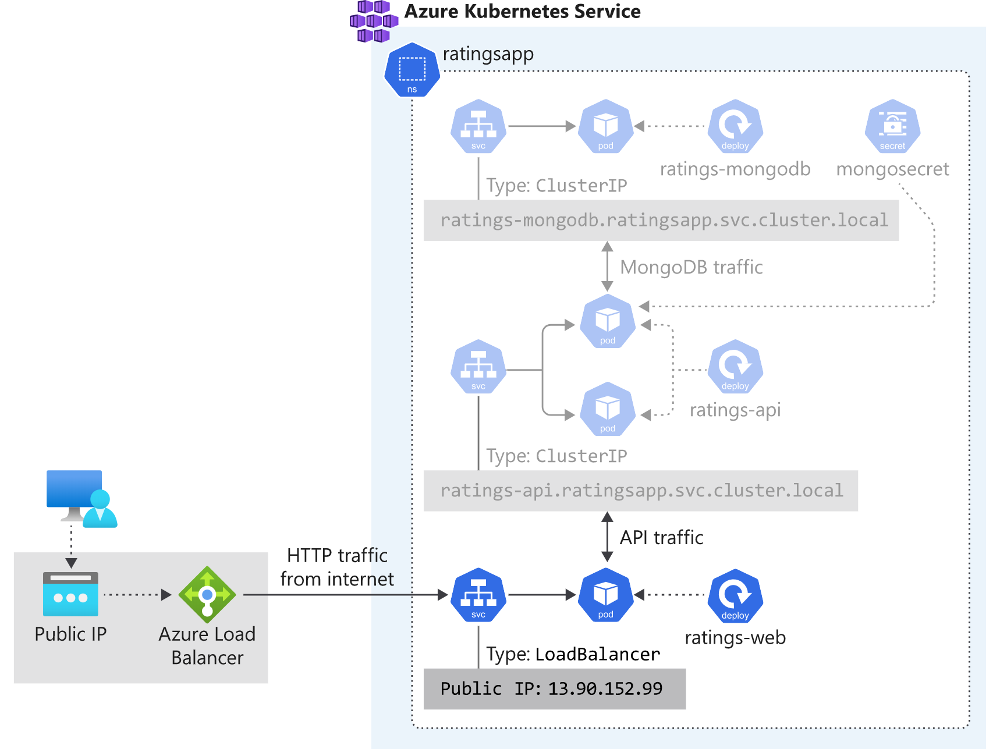

# Challenge Guide

## Operationalizing Azure Kubernetes Service

## Overview

A new customer, Fruit Smashers, has approached to you take on the management and operations of one or more containerized applications which are hosted in an existing Azure Kubernetes Service (AKS) cluster. Currently, a popular website for rating fruit smoothie flavors - Fruit Smoothies by Fruit Smashers - is deployed in the cluster and a new application will be coming online shortly to allow guests to Fruit Smashers corporate headquarters to leave messages about the favorite part of their visit. While the existing platform and underlying deployment(s) meet the needs of the business, Fruit Smashers plans to grow their online presence significantly as more customers move to online ordering exclusively. They anticipate that growth will be organic and bursty.

## Accessing Microsoft Azure

Launch Chrome from the virtual machine desktop and navigate to the URL below. Your Azure Credentials are available by clicking the Cloud Icon at the top of the Lab Player.

```sh
https://portal.azure.com
```

## Challenge 1: Implementing AKS to meeting customer requirements

You customer has an existing AKS deployment with running containers and supporting infrastructure such as MongoDB, Redis, and Azure Container Registry. Over time, their needs have shifted with AKS and they now are ready to adopt the latest features of AKS to better position themselves for security and access to the latest features of AKS, starting with their Fruit Smoothie ratings application.

- The existing deployment utilizes a single namespace (default) with the existing application and its supporting services deployed. As new applications are onboarded, further isolation will be required.
- Existing developers have access to the `default` and `kube-system` namespaces. As new applications are onboarded, each development team will need access to only their resources for deployment and service management.

They would like to maintain their existing architecture, transitioning the existing application to a dedicated namespace for Fruit Smoothies. For example:



Your initial challenge is to configure the existing application in a dedicated namespace and allow only the `Fruit Smashers Smoothers` security group access to the namespace.

### Environment details

The current development team has authored a <a href="https://github.com/opsgility/lab-support-public/blob/master/akschallenge/ratingsapp/deploy.sh" target="_blank">script</a> which they use to assist them in their deployments. The script is responsible for the creation and deployment of:

- A new AKS cluster in a dedicated VNet
- An Azure Container Registry for storing container images for an API and the frontend website
- Deployment of the API and frontend website containers and support services

Service are deployed using a series of standard Kubernetes YAML definitions:

```sh
echo "Deploying ratings-api..."
kubectl apply \
    -f ratings-api-deployment.yaml

kubectl get deployment ratings-api

echo "Deploying ratings-api service..."
kubectl apply \
    -f ratings-api-service.yaml

echo "Deploying ratings-web..."
kubectl apply \
    -f ratings-web-deployment.yaml

echo "Deploying ratings-web service..."
kubectl apply \
    -f ratings-web-service.yaml
```

The definitions can be found at <a href="https://github.com/opsgility/lab-support-public/tree/master/akschallenge/ratingsapp" target="_blank">lab-support-public/akschallenge/ratingsapp</a>.

Each of the deployments has a property `image:` which defines which ACR to pull images from on deployment. The deployment script dynamically updates these values and you should account for this in any new deployments. For example:

```sh
image: ACR_NAME.azurecr.io/ratings-api:v1 # IMPORTANT: update with your own repository
```

Becomes:

```sh
image: acr414134.azurecr.io/ratings-api:v1 # IMPORTANT: update with your own repository
```

## Success criteria

Explain to your coach:

- How you addressed each of these issues and mitigated your customer's concerns.

## Progressing to the next challenge

After you have completed the challenge, click the **Mark complete** button to inform your coach you are ready for review.

## Help Resources

- <a href="https://docs.microsoft.com/azure/aks/intro-kubernetes" target="_blank">Azure Kubernetes Service (AKS)</a>
- <a href="https://docs.microsoft.com/azure/sql-database/sql-database-technical-overview" target="_blank">What is the Azure SQL Database service?</a>
