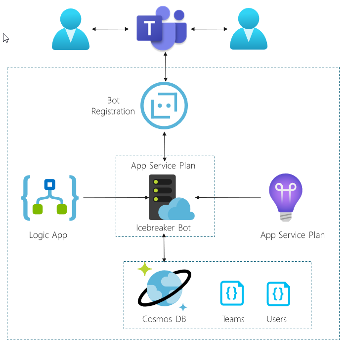

# Keep In Touch App Challenge Guide

## Overview

<span class="colour" style="color:rgb(36, 41, 46)">In this challenge, you will be tasked to complete a variety of Azure challenges to build the Keep In Touch App. These exercises will use almost no code to get to the end result while introducing very important pieces of technology.</span>

## <span class="colour" style="color:rgb(36, 41, 46)">Accessing Microsoft Azure</span>

<span class="colour" style="color:rgb(36, 41, 46)">Launch Chrome from the virtual machine desktop and navigate to the URL below. Log in using the provided Azure lab credentials, which are available by clicking the cloud icon at the top of the Lab Player.</span>
<span class="colour" style="color:rgb(36, 41, 46)"></span>

```
https://portal.azure.com
```

## Challenge 1: Install and run the Icebreaker app

Starting at the Icebreaker app follow the deployment instructions and return here

[https://github.com/OfficeDev/microsoft-teams-icebreaker-app/wiki/Deployment-guide](https://github.com/OfficeDev/microsoft-teams-icebreaker-app/wiki/Deployment-guide)  
Final Icebreaker deployment architecture




## Success criteria

* You should have two users that were matched using the application and had the option to either chat or schedule a meeting

## Progressing to the Next Challenge

<span class="colour" style="color:rgb(36, 41, 46)">After you have completed the challenge, click the </span>**Validate**<span class="colour" style="color:rgb(36, 41, 46)"> button to check your results.</span>
