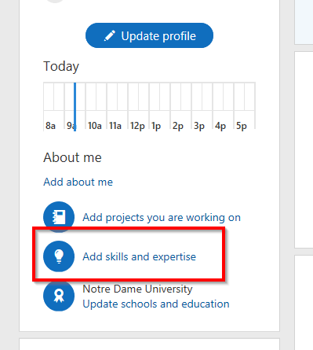
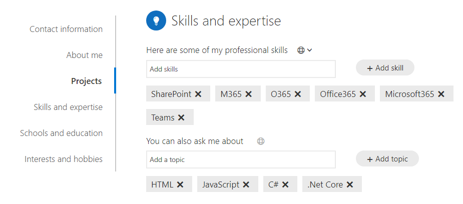

# Keep In Touch App Challenge Guide

## Challenge 2: Extend the Icebreaker App

In this challenge, you will add some skills to the two users that you interacted with in the Icebreaker app. In an incognito or InPrivate browser session visit
<br>
```
https://office.com
```

Once logged in click on the **Outlook** icon  


Once in Outlook click on the colored icon in the upper right-hand corner to open a menu. Then click on **My Office profile**  


This will open up information about your Office profile. In the center of the page click on the link that says **Add skills and expertise**  


For each user add in at least one matching skill and a few un-matching skills. Because we are not using code remember spelling and capital letters count!  

  

## Success Critieria

* You should have two users that have their profiles updated with new skills

## Progressing to the next challenge
