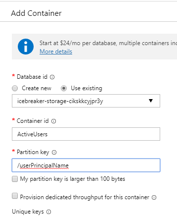
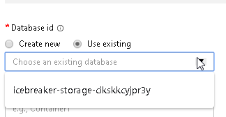

# Keep In Touch App Challenge Guide

## Challenge 3: Create Data Storage for your App

In this challenge, you will create a Cosmos DB container that will be used to store user information generated by your Teams application.

In an incognito or InPrivate browser session visit
<br>
```
https://portal.azure.com
```

Once logged in click on the All resources link in either the left-hand navigation or on the main landing page.  


Look in the second column of the grid that is display and look for **Azure Cosmos DB** then click on the name of the database


On the Cosmos DB account page click on the **+ Add Container** button  



<br>
<span class="colour" style="color:rgb(36, 41, 46)">In the menu pane on the right </span>
Change the Database id radio button to **Use existing** and change the dropdown to select the existing database (your name will be different)


Then enter a Container id name of **ActiveUsers**

Add a new container Partition key using **userPrincipalName** 


## <span class="colour" style="color:rgb(36, 41, 46)">Succcess Criteria</span>

* <span class="colour" style="color:rgb(36, 41, 46)">You have created two new containers</span>

## Progressing to the next challenge<span class="colour" style="color:rgb(36, 41, 46)"></span>

<span class="colour" style="color:rgb(36, 41, 46)"></span>
 ## Resources
 ```
 https://docs.microsoft.com/en-us/azure/cosmos-db/how-to-create-container
 ```
