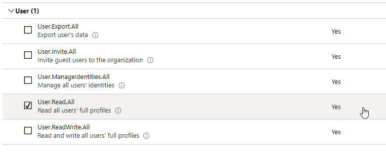

# Keep In Touch App Challenge Guide

## Challenge 4: Setting up permissions

In this challenge, you will add some skills to the two users that you interacted with in the Icebreaker app. In an incognito or InPrivate browser session visit
<br>
```
https://portal.azure.com
```
<br>
In the Azure portal visit Azure Active Directory. Because it is necessary to read information from the Graph API we need to add permissions.

* Click on App Registrations and select the Application registered when creating the IceBreaker app. Then click on API Permissions in the left-hand navigations.
* Click on the Add a permission button.
* Click on the Microsoft Graph button
* Click on Application permissions
* Scroll down till the Users permission section is visible and check User.Read.All
* Finally click Add permissions



## <span class="colour" style="color:rgb(36, 41, 46)">Succcess Criteria</span>

* <span class="colour" style="color:rgb(36, 41, 46)">You have allowed permissions to utilize the Graph API</span>

## Progressing to the next challenge
<br>
<br>
