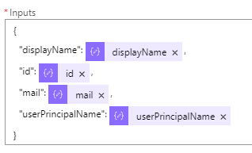
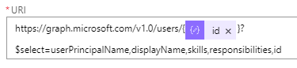
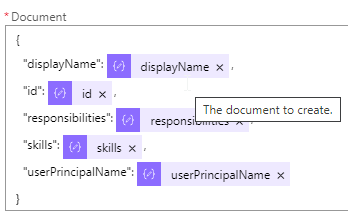
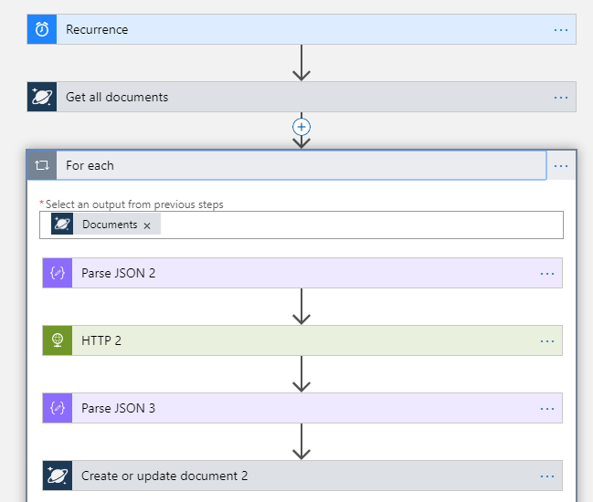

# Keep In Touch App Challenge Guide

## Challenge 6: Integrating into Logic App

* Now create a new Logic App for retrieving all the users and storing them in Cosmos. 
* The **HTTP** step will have the following attributes:
    * **Method**: Get
    * **URI**: [https://graph.microsoft.com/v1.0/users/](https://graph.microsoft.com/v1.0/users/)
    * **Authentication Type**: Active Directory OAuth
    * **Tenant**: use your tenant domain
    * **Audience**: [https://graph.microsoft.com](https://graph.microsoft.com)
    * **Client ID**: ID from the IceBreaker application created in Azure Active Directory
    * **Credential Type**: Secret
    * **Secret**: Secret from IceBreaker application created in Azure Active Directory
* The **Parse JSON** step has the following attributes:
    * Content: [Body] from previous step
    * Schema: Copy the following code into the schema portion
```json
{
    "properties": {
        "@@odata.context": {
            "type": "string"
        },
        "value": {
            "items": {
                "properties": {
                    "displayName": {
                        "type": "string"
                    },
                    "givenName": {
                        "type": "string"
                    },
                    "id": {
                        "type": "string"
                    },
                    "jobTitle": {},
                    "mail": {},
                    "userPrincipalName": {
                        "type": "string"
                    }
                },
                "required": [
                    "mail",
                    "userPrincipalName",
                    "id"
                ],
                "type": "object"
            },
            "type": "array"
        }
    },
    "type": "object"
}
```
        

* The **For each** step has the following attributes:
    * Select an output from previous steps: [Value]  
    * Add a Compose step and make it look like the following graphic   
      
    * Add a Cosmos DB **Create or update document** step
        * Database ID: Select the Cosmos DB created from the Icebreaker app
        * Collection ID: ActiveUsers
        * Document: [Outputs]
        * Click the Add new parameter dropdown and check Partition Key value: "[userPrincipalName]". Please ensure you add quotes before and after adding [userPrincipalName].


* After validating that users are being populated in the new ActiveUsers container in CosmosDB create another Logic App to iterate through all the users in that container and pull their respective profiles to store in the UserProfiles container.
* Add a new Cosmos DB **Get all documents** step  
    * Set the Database ID to the Icebreaker Database name in the dropdown.
    * Set the Collection ID to **ActiveUsers**  
* Add a new For Each step and set the output to [Documents] from the previous step.
* Add a new Parse JSON step and set the Content to [Current Item]
* In the schema paste in the following
```json
{
    "$schema": "http://json-schema.org/draft-04/schema#",
    "properties": {
        "_attachments": {
            "type": "string"
        },
        "_etag": {
            "type": "string"
        },
        "_rid": {
            "type": "string"
        },
        "_self": {
            "type": "string"
        },
        "_ts": {
            "type": "integer"
        },
        "displayName": {
            "type": "string"
        },
        "id": {
            "type": "string"
        },
        "userPrincipalName": {
            "type": "string"
        }
    },
    "required": [
        "displayName",
        "id",
        "userPrincipalName",
        "_rid",
        "_self",
        "_etag",
        "_attachments",
        "_ts"
    ],
    "type": "object"
}
```
* Add a HTTP step  
    * Set the **Method** to Get
    * Set the **URI** to the second Graph API query so it will end up looking like the following  
       
    * Set the **Authentication Type** to Active Directory OAuth
    * Set your **Tenant** to your prefix.onmicrosoft.com
    * **Audience** is set to https://graph.microsoft.com  
    * **Client ID** is the Application ID from the Icebreaker app
    * The **Credential type** need to be set to Secret
    * The **Secret** value is the secret from the Icebreaker app.  
* Add a Parse JSON step
    * Set the **Content** value as [Body] from the previous step
    * Copy the following into the Schema field  
```json
{
    "properties": {
        "@@odata.context": {
            "type": "string"
        },
        "displayName": {
            "type": "string"
        },
        "id": {
            "type": "string"
        },
        "responsibilities": {
            "type": "array"
        },
        "skills": {
            "type": "array"
        },
        "userPrincipalName": {
            "type": "string"
        }
    },
    "type": "object"
}
```  
* Add a new CosmosDB **Create or update document** step  
    * Set the **Database ID** to the Icebreaker database
    * Set the **Collection ID** to UserProfiles
    * Make the **Document** section look like the following  
      
    * Set the Partition key value to "[userPrincipalName]"  
    
    

    
      



## <span class="colour" style="color: rgb(36, 41, 46);">Succcess Criteria</span>

* <span class="colour" style="color: rgb(36, 41, 46);">You have added two new Logic Apps</span>

## Progressing to the next challenge
