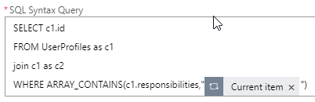
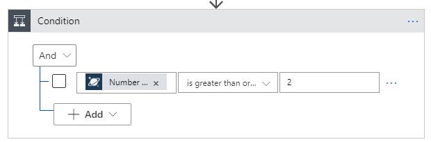
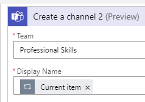

# Keep In Touch App Challenge Guide

## Challenge 7: Integrating Teams and Logic App

* Create a new Team in Micosoft Teams called **Professional Skills.**


* **NOTE**: *There is a current bug in the distinct select statement in CosmosDB Logic App integrations. Until this is resolved the initial step will be 'hard coded.'*    
The final Logic App will execute a stored procedure. The initial portion will do a UDF query to get the all the skills into a simple JSON structure. The second portion of the query will find the count of users that match those skills. If the count of users is greater than 1 then create a new channel with the matched skill in the newly created Team.    
* Add a new **Initialize variable** step 
    * Set the **Name** to responsibilites
    * Set the **Type** to Array
    * Set the Value to the following
        ```json
        [
          "HTML",
          "JavaScript",
          "C#",
          ".Net Core"
        ]
        ```
* Add a new **For Each** step
    * Set the output from previous steps as [responsibilities]
    * Add a **Cosmos DB Query documents** V3 step
    * Set the **Database ID** to the Icebreaker database
    * Set the **Collection ID** to UserProfiles
    * Set the **SQL Syntax Query** to look like the following  
      
* Add a **Condition** Step  
    * In the first field select the [Number of Documents]
    * In the second field change it to "is greater than or equal to"  
    * In the third field enter 2  
      
* In the If true step add a Teams Create a channel (Preview) step  
    * Set the Team to Professional Skills 
    * Set the Display Name to [Current Item]  
    
* Click Save

*The newly created Logic App


* Example of newly created channel  


### Overall architecture  


<br>


## Succcess Criteria

* <span class="colour" style="color:rgb(36, 41, 46)">You have added created a new channel In Microsoft Teams using Logic Apps in Azure</span>
