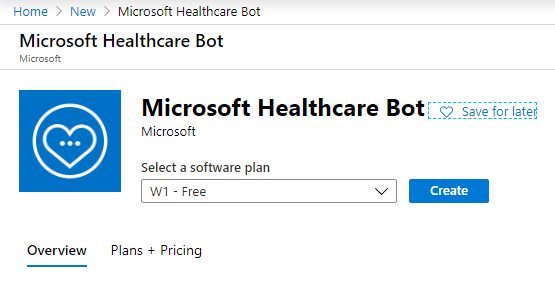
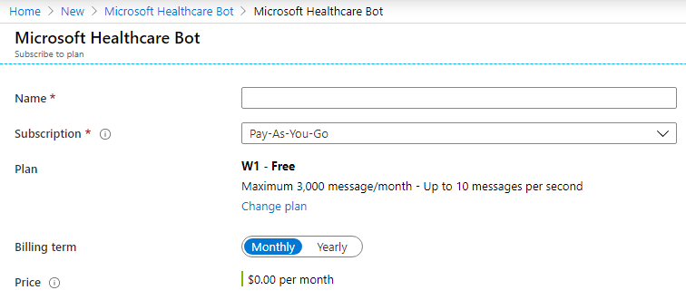

# Healthcare Challenge Guide

## Overview

<span class="colour" style="color:rgb(36, 41, 46)">In this challenge, you will be tasked to complete a variety of tasks to add and customize an existing Healthcare bot. The bot will triage a users symptoms and at the end will provide a link to create an instant virtual telemedicine face-to-face call with a custom application that integrates with Microsoft Teams. </span>

## <span class="colour" style="color:rgb(36, 41, 46)">Accessing Microsoft Azure</span>

<span class="colour" style="color:rgb(36, 41, 46)">Launch Chrome from the virtual machine desktop and navigate to the URL below. Log in using the provided Azure lab credentials, which are available by clicking the cloud icon at the top of the Lab Player.</span>
<span class="colour" style="color:rgb(36, 41, 46)"></span>

```
https://portal.azure.com
```

## Challenge 1: Create a Healthcare Bot

* Create a New Resource and search for Healthcare Bot 

  
    * Ensure that the software plan dropdown is set to W1 - Free  
    * Click the Create button
* Subscribe to the Healthcare Bot plan  
    * Name: [yourinitials]HealthcareBot (it does have to be globally unique)
    * Subscription: Validate the correct subscription
    * Click the Subscribe button at the bottom left hand corner  
    * Wait for the deployment
    
    

## Success criteria

* You should have two users that were matched using the application and had the option to either chat or schedule a meeting

## Progressing to the Next Challenge

<span class="colour" style="color:rgb(36, 41, 46)">After you have completed the challenge, click the </span>**Validate**<span class="colour" style="color:rgb(36, 41, 46)"> button to check your results.</span>

## Resources
```
https://docs.microsoft.com/en-us/healthbot/
```
