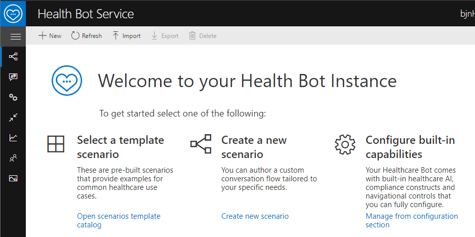
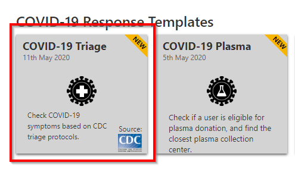
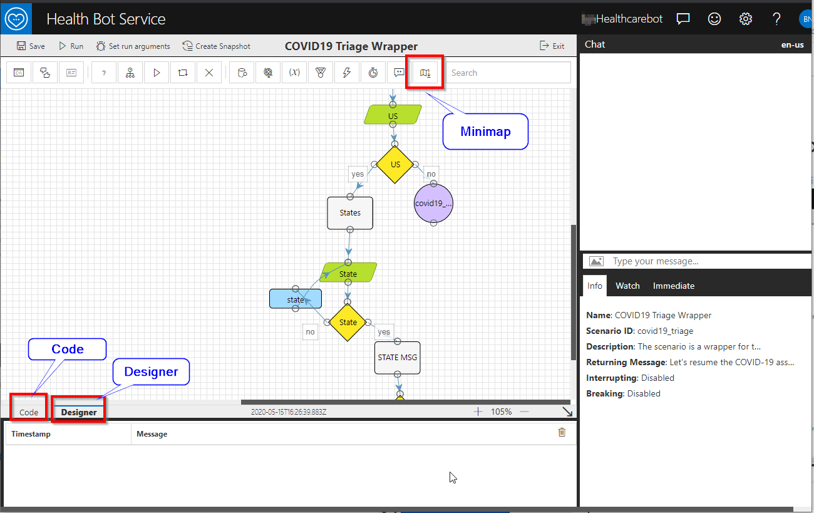
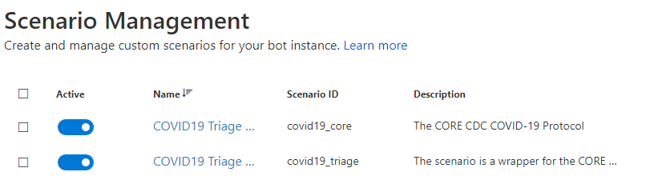
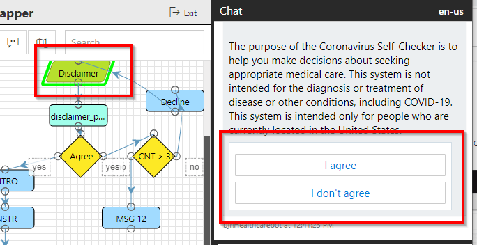

# Healthcare Challenge Guide


## <span class="colour" style="color:rgb(36, 41, 46)">Accessing Microsoft Azure</span>

<span class="colour" style="color:rgb(36, 41, 46)">Launch Chrome from the virtual machine desktop and navigate to the URL below. Log in using the provided Azure lab credentials, which are available by clicking the cloud icon at the top of the Lab Player.</span>
<span class="colour" style="color:rgb(36, 41, 46)"></span>

```
https://docs.microsoft.com/en-us/healthbot/quickstart-createyourhealthcarebot
```

## Challenge 2: Select a Healthcare Bot template scenario

* Health Bot Instance welcome page
  
* Click on the Open scenarios template catalog link
* Select the COVID-19 Triage template  
    * In the slideout click the Import Template button at the bottom of the page  

* Design and coding  

* Design tab (Covid19 Triage Wrapper)
    * In the Design Tab click the Minimap button so you can see all the icons. You may have to use the scroll bars.
    * This is a process flow that looks similar to Visio  
    * Prompts are green, if/else decisions are yellow, print out statements are blue
    * Click the Exit button at the top
* Scenario Management
    * The COVID19 Triage Bot utilizes two difference scenarios. The main is the "CORE CDC COVID-19 Protocol" and the second is the "scenario wrapper."
    * The core scenario is broken out here in a [pdf](https://github.com/CDCgov/covid19healthbot/blob/master/screening_protocols/covid_19_screening_protocol_cdc_apple.pdf)  
    
    
* Run the bot
    * To run the bot click on the COVID19 Triage scenario
    * Then click the Run button at the top  
    
    * You will notice the chat window populate with information and also the Designer will highlight which part of the process it is currently in. You can proceed through the Triage bot answering each question till the end. To stop the bot you can click Exit again.  
    
## Success criteria

* You have setup the Health Bot COVID-19 Template scenario and explored the Scenario Management available in the Health Bot Service.

## Progressing to the Next Challenge

<span class="colour" style="color:rgb(36, 41, 46)">After you have completed the challenge, click the </span>**Validate**<span class="colour" style="color:rgb(36, 41, 46)"> button to check your results.</span>
