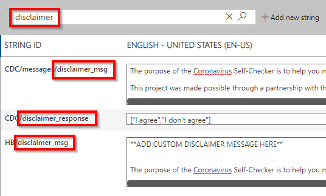
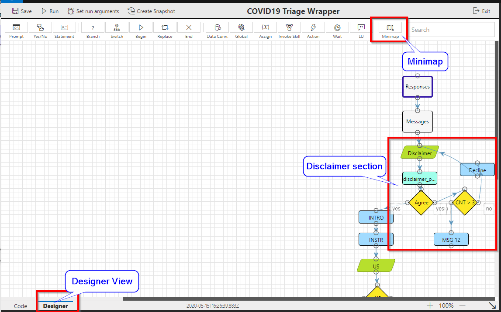
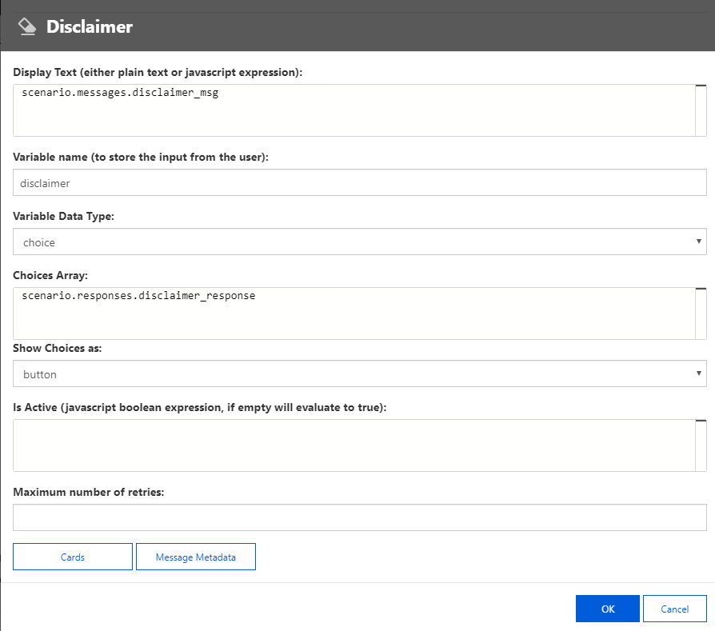
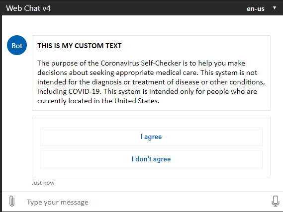

# Healthcare Challenge Guide


## <span class="colour" style="color:rgb(36, 41, 46)">Accessing Microsoft Azure</span>

<span class="colour" style="color:rgb(36, 41, 46)">Launch Chrome from the virtual machine desktop and navigate to the URL below. Log in using the provided Azure lab credentials, which are available by clicking the cloud icon at the top of the Lab Player.</span>
<span class="colour" style="color:rgb(36, 41, 46)"></span>

```
https://admin.healthbot.microsoft.com/
```

## Challenge 3: Customizing the Health Bot messages

* Scenario Management Landing Page
  
* In the left hand menu select Language then click on Localization
  
* On the left side you will see multiple languages  
* In the larger pane you will see a long list of strings setup as a Key/Value pair. Which means the value on the left (STRING ID) is used as a reference in the bot to display the message which is in the right side.  
* Using the text box at the top of the page search for the following: *disclaimer*  
* Notice that the page has been filtered to STRING IDs that match the word *disclaimer*  

* If you look at the first result you will notice a pattern *CDC/messages/disclaimer_msg* Let's figure out when that is called in the Health Bot.
* Open a new browser tab and visit  
```
https://admin.healthbot.microsoft.com/
```  
* Click the second link for COVID19 Triage. The description will say "The scenario is a wrapper for the CORE..." 
* Ensure that you are in the Designer view and use the scroll bars until the flow looks similar the following graphic. Then close the minimap by clicking on it one time in the menu.  
   
* Double-click on the first green icon that says Disclaimer to open the properties of the prompt message.    

* Notice the first text box under the heading Display Text. It has the value *scenario.messages.disclaimer_msg* If you switch back to the previous tab you can see that the first value ends with *disclaimer_msg*
* Now switch tabs to the Disclaimer prompt again. Notice the third option is *Variable Data Type*: with a value of *scenario.responses.disclaimer_response* and *Show Choices* as *button*  
** So this prompt combines two pieces. The first is to display the *disclaimer_msg* and the second is to display Choices from *disclaimer_response* as buttons.  
* In the upper left-hand corner click on the *Run* button. This will start the interactive Designer and start the chat in the upper right-hand corner. You will notice the text includes the words *ADD CUSTOM DISCLAIMER MESSAGE HERE* and the two buttons also match the previous tab. Click on the Exit button to the left of the web chat. 
* Switch back to the previous tab and let's make an update. In the disclaimer_msg replace the text **ADD CUSTOM DISCLAIMER HERE** with **THIS IS MY CUSTOM TEXT**  
* After making the change switch back to the Scenarios and select the second COVID19 scenario again.  
* Click the Run button again and verify your changes are visible.  

## Success criteria

* You have successfully modified the Healthcare Bot to display a custom message  

## Progressing to the Next Challenge

<span class="colour" style="color:rgb(36, 41, 46)">After you have completed the challenge, click the </span>**Validate**<span class="colour" style="color:rgb(36, 41, 46)"> button to check your results.</span>
