# Healthcare Challenge Guide


## <span class="colour" style="color:rgb(36, 41, 46)">Accessing Microsoft Azure</span>

<span class="colour" style="color:rgb(36, 41, 46)">Launch Chrome from the virtual machine desktop and navigate to the URL below. Log in using the provided Azure lab credentials, which are available by clicking the cloud icon at the top of the Lab Player.</span>
<span class="colour" style="color:rgb(36, 41, 46)"></span>

```
https://admin.healthbot.microsoft.com/
```

## Challenge 4: Adding Telemedicine Application
The goal of this exercise is to offer someone the opportunity to create a Telemedicine video-conference call directly from the Health Bot    
* Scenario Management Landing Page
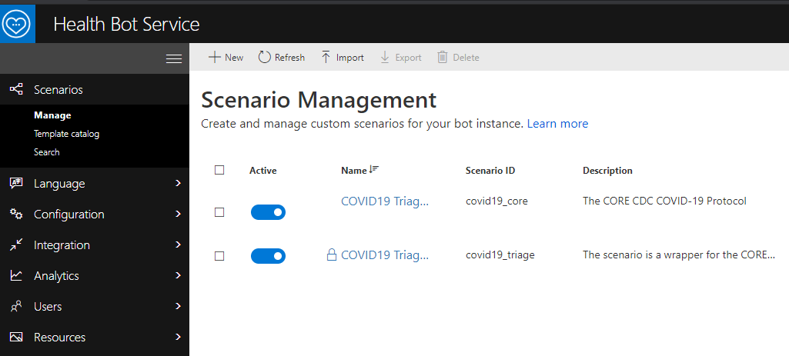  
* In the left hand menu select Language then click on Localization
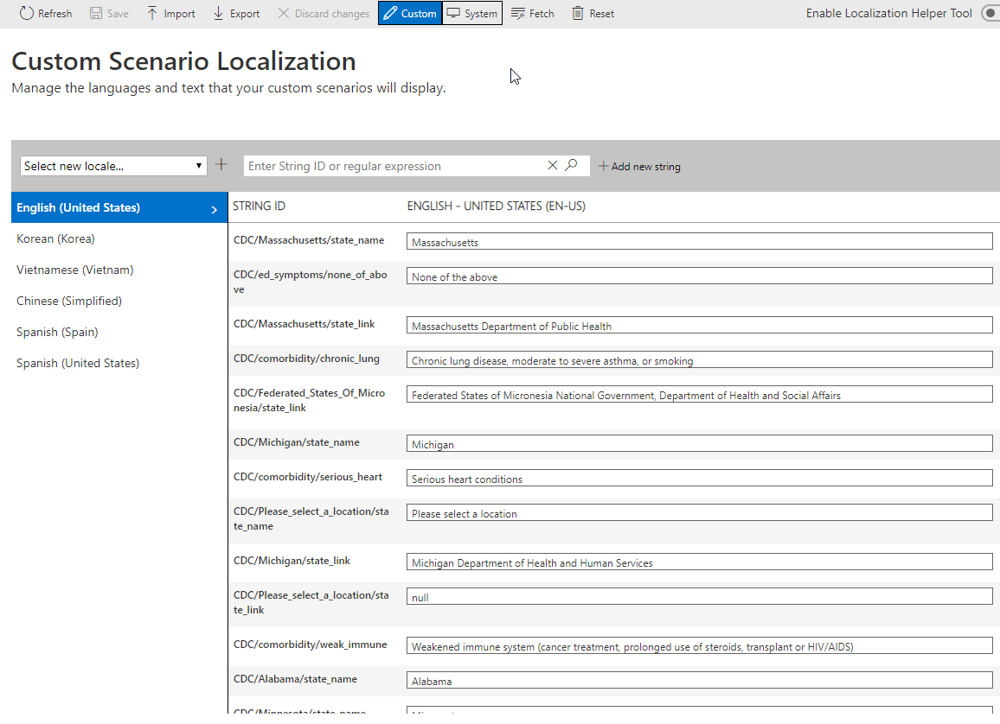  
* Using the text box at the top of the page search for the following: *msg*  
* Notice that the page has been filtered to STRING IDs that match the word *msg*  
 

* If you look at the seventh result you will notice a pattern *CDC/messages/msg1* This message currently has the following message  
```  
**Sounds like you are feeling ok.**  

Learn more about COVID-19 and what you can do to stay safe on the [CDC website](https://www.cdc.gov/coronavirus/2019-ncov/index.html).
```
* The text is utilizing a format called markdown. For more information about markdown formatting please visit this link
```
https://www.markdownguide.org/cheat-sheet/
```
* According to the guide the first line is a bold statement followed by some text and some links.  
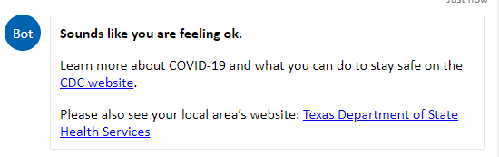
* To view this message yourself you can Run the COVID19 Triage Wrapper scenario using the following steps. I would suggest opening another tab so you don't loose the message we are going to modify. There are many paths in the COVID19 path that can potentially lead to the same result message. This is just a reproducible one.  
```
"This is my custom text"
  - Click the I agree button
"Where are you located"
  - Click the United States button
"Where in the United States are you located?"
  - Choose Texas
  - Click the Submit button
"Are you ill, or caring for someone who is ill?"
  - Click the No button
"Are you answering for yourself or someone else?"
  - Click Myself
"What is your age?"
  - Choose 60-64
"In the last two weeks, did you care for or have close contact with someone diagnosed with COVID-19?"
  - Click the No button
  
```
* After you follow this path you might notice there are three messages displayed. We want to add a fourth message.
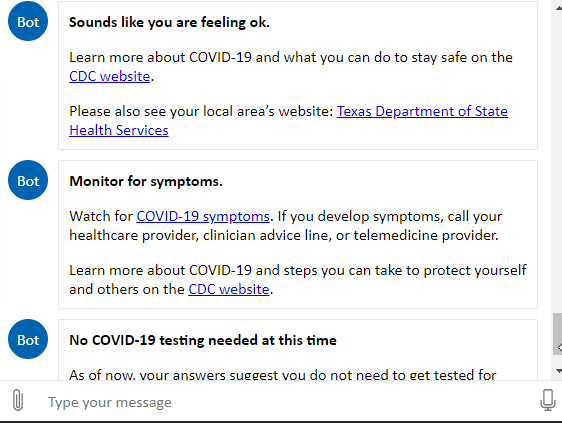

* The changes we are going to make are in the COVID 19 Triage Core. So open that scenario and using the minimapper navigate to near the center of the flow on the left side.  
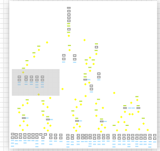  
* We will be adding a message to the section on the right  
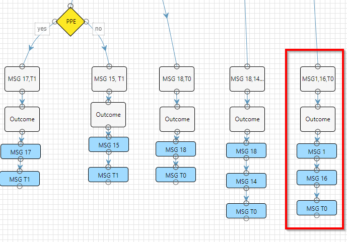   
* Navigate back to the Custom Scenarion Localization tab and copy the STRING ID for *CDC/messages/msg1*. We do not want to conflict with any other messages so ours will be *CDC/messages/msg101*
* Click the Add new string button at the top  
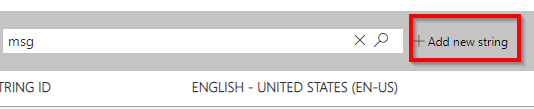  
* Enter *CDC/messages/msg101* in the first text box and then in the second text box we are going to use some markdown. Use the following 
```
If you would be interested in scheduling a Telemedicine video-conference call please click the link below  

[Telemedicine](https://localhost:3000)
```  
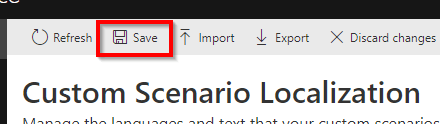
* Click the Save button at the top of the page
* Switch tabs back open the COVID19 Triage Core in Designer mode
* Using the minimapper navigate to the top section  
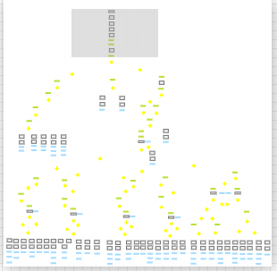  
* Double click on the Action icon called *DICT*  
* We need to map our new value inside this JavaScript
* Scroll down to the bottom of the expression and look for the line that contains *msg18*
* Copy that line and paste it below the *msg18* line. Change it to the following  
```
msg101: customLocalizedStrings["CDC/messages/msg101"],
```
* The final result will look like the following
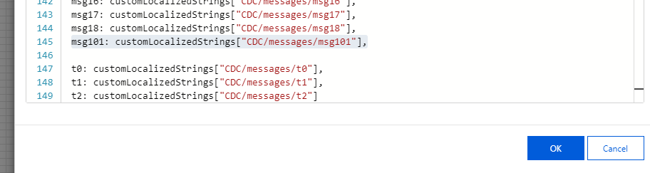  
* Click Ok to close the Action.
* Now navigate back to the center left of the flow
 
* Drag a Statement below *MSG T0* and enter the following values
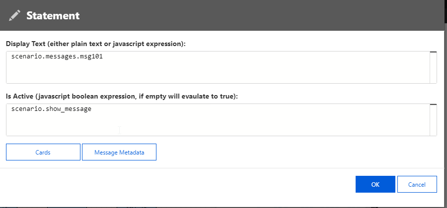
* Now click the pencil icon next to the word Statement
* Change it to Telemedicine
* Click OK
* Current result looks like the following  
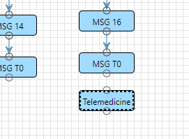 
* Click the bottom small circle from *MSG T0* Statement and drag it to the top small circle on the new *Telemedicine* Statement
* Final Result  
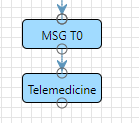
* Click Save in the upper left-hand corner
* Now click Exit and open the COVID19 Triage Wrapper
* Now click Run and follow the previous steps to see the new message added to the result.  
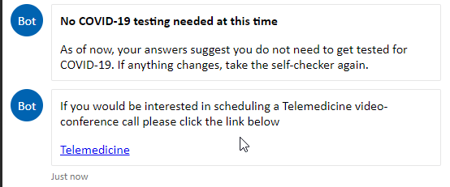


## Success criteria

* You have successfully modified the Healthcare Bot to display a custom Statement

## Progressing to the Next Challenge

<span class="colour" style="color:rgb(36, 41, 46)">After you have completed the challenge, click the </span>**Validate**<span class="colour" style="color:rgb(36, 41, 46)"> button to check your results.</span>
