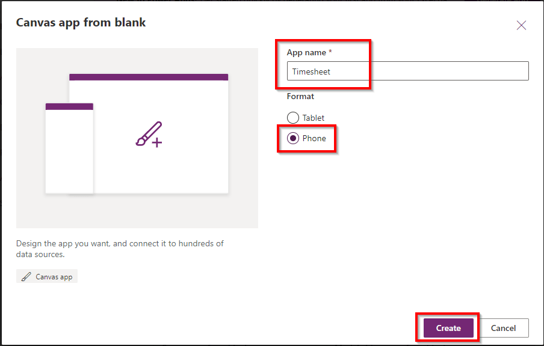
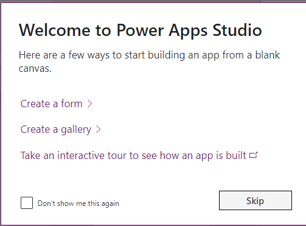
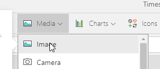
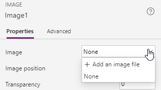
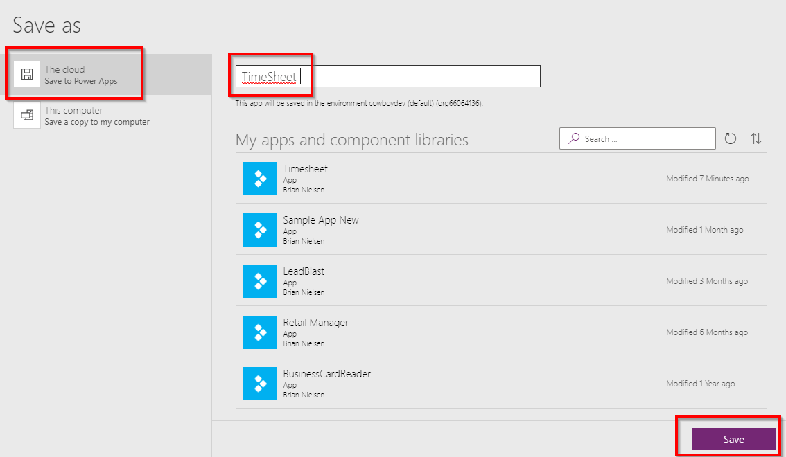
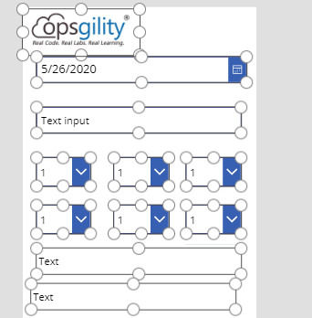

# Time sheet Challenge Guide

## Overview

<span class="colour" style="color:rgb(36, 41, 46)">In this challenge, you will be tasked to complete a variety of local and Azure challenges to setup a a Time sheet application. The end goal will be extending the application to utilize a PowerApp that front-line workers can utilize on a mobile phone to eliminate the need of sharing a computer to login to input time. </span>

## <span class="colour" style="color:rgb(36, 41, 46)">Accessing Microsoft Azure</span>

<span class="colour" style="color:rgb(36, 41, 46)">Launch Chrome from the virtual machine desktop and navigate to the URL below. Log in using the provided Azure lab credentials, which are available by clicking the cloud icon at the top of the Lab Player.</span>
<span class="colour" style="color:rgb(36, 41, 46)"></span>

```
https://powerapps.microsoft.com/en-us/
```

## Challenge 1: Build PowerApp layout

This organization has been using the Timesheet application for a number of years. The front-line workers that use this application to enter their times use a shared computer. Due to COVID-19 there was a need to reduce the amount of people touching the computer so it was decided to build a PowerApp and utilize a Flow to allow the creation of the data. The users then can download the mobile PowerApp application locally on their phone.  
* Starting on the Power Apps landing page click on the icon that says *Canvas app from blank*.  
  
* Enter the name *Timesheet*  
* Set the format to Phone  
* Click the Create button  
  
* Note: If you get a popup with Welcome screen you can click the *Skip* button for now.  
  
* Starting in the upper left hand corner select the Insert tab. This changes the navigation below the Insert tab to the components we need.  
  
* Start by clicking the Media button and selecting Image. This will put a image component on the canvas.  
  
* With the image selected view the properties on the right-hand side. Where Image says *None* click on the dropdown and select *Add an image file*.  

* Select the blob image from the *ChallengeImages* folder and change the *Image Position* to *Fill*. Then using the bounding box make the height smaller to just fit the image.  
  
* Let's Save the Power App. Select File -> Save. The select The cloud (Save to Power Apps). Validate the name of your application and click the Save button in the bottom right-hand corner.  
  
* After saving click the arrow in the upper left-hand corner to continue editing.  

* From the Input tab insert the following on the canvas  
    * Date picker
    * Text Input
    * Dropdown (copy & paste this one to have a total of six)
    * Add two labels
* Modify the layout, sizes and order so they resemble the following.   

* Save your layout


## Success criteria

* You should have at a basic PowerApp with all the required fields for submitting a Timesheet.

## Progressing to the Next Challenge

