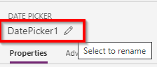
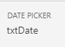
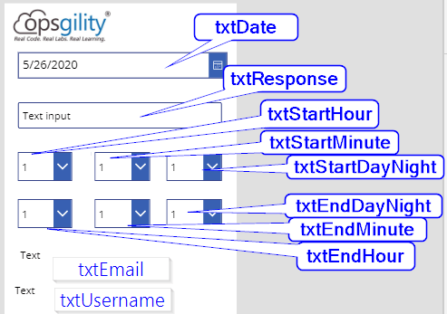
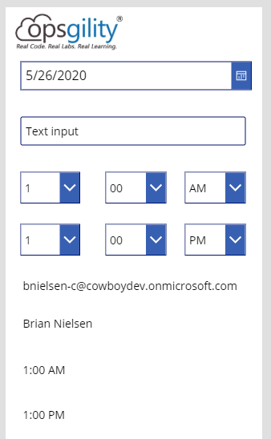

# Time sheet Challenge Guide

## Overview

<span class="colour" style="color:rgb(36, 41, 46)">In this challenge, you will be tasked to complete a variety of local and Azure challenges to setup a a Time sheet application. The end goal will be extending the application to utilize a PowerApp that front-line workers can utilize on a mobile phone to eliminate the need of sharing a computer to login to input time. </span>

## <span class="colour" style="color:rgb(36, 41, 46)">Accessing Microsoft Azure</span>

<span class="colour" style="color:rgb(36, 41, 46)">Launch Chrome from the virtual machine desktop and navigate to the URL below. Log in using the provided Azure lab credentials, which are available by clicking the cloud icon at the top of the Lab Player.</span>
<span class="colour" style="color:rgb(36, 41, 46)"></span>

```
https://powerapps.microsoft.com/en-us/
```

## Challenge 1: Setting up Power App for data submission

* Starting in the canvas from the previous challenge select the components and give them appropriate names.
* To name the Date component: Select it and in the upper right-hand side of the properties pane and mouseover on the text below DATE PICKER (eg. DatePicker1) until you see a pencil. Click the pencil and change the name to txtDate. Hit the Enter key on your keyboard to commit the change. 
*Before  

* After  
  
* Continue renaming the components to match the following image  

* Save your changes CTRL-S
* Next we are going to set the values in each dropdown. Click on one of the hour dropdowns. Click on Advanced properties and in the Items section put in the following for both hours dropdowns.  
```
["1","2","3","4","5","6","7","8","9","10","11","12"]
```  
* Next select one of the minute columns and click on Advanced properties and in the Items section put in the following for both minutes dropdowns. Also set the Default value to "00".
```
["00","15","30","45"]
```  
* Next select one of the DayNight columns and click on Advanced properties and in the Items section put in the following for both DayNight dropdowns. Also set the Default value to "AM" for the start and "PM" for the end
```
["AM","PM"]
```  
* Save your changes CTRL-S
* Add two more labels to the canvas. Position them at the very bottom. In the future we will hide them. Give them the following names:
    * txtCalcStart
    * txtCalcEnd
* Select the txtCalcSTart, Validate you are setting the Text value then look for the Formula field at the top of the page   
* Copy the following value and hit Enter on your keyboard to commit 
```
TimeValue(txtStartHour.Selected.Value & ":" & txtStartMinute.Selected.Value & " " & txtStartDayNight.Selected.Value)
```  
* Then for the txtCalcEnd copy the following in the Text value  
```
TimeValue(txtEndHour.Selected.Value & ":" & txtEndMinute.Selected.Value & " " & txtEndDayNight.Selected.Value)
```  
* Select the txtEmail label and set the text value to 
```
User().Email
```  
* Select the txtUsername label and set the text value to 
```
User().Fullname
```    
* The final result should resemble the following  

* Save your changes CTRL-S


## Success criteria

* You should have at a basic PowerApp with all the automatically calculating values.

## Progressing to the Next Challenge

