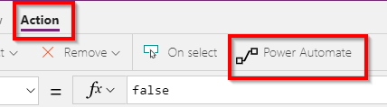
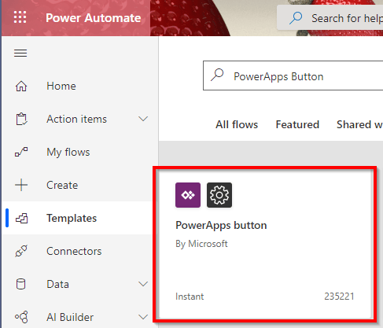
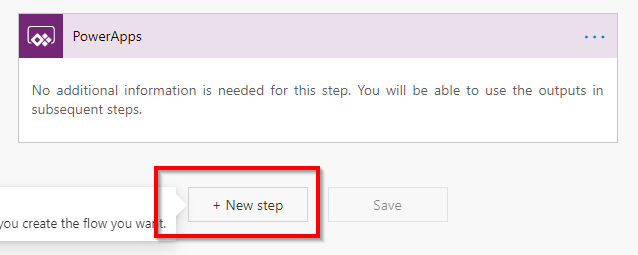
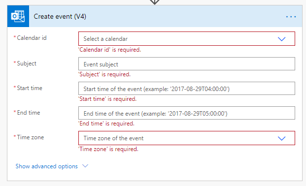
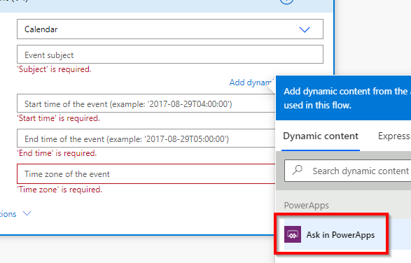
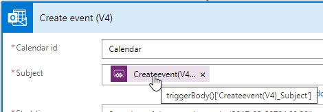
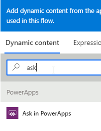
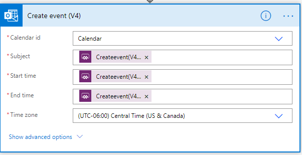

# Time sheet Challenge Guide

## Overview

<span class="colour" style="color:rgb(36, 41, 46)">In this challenge, you will be tasked to complete a variety of local and Azure challenges to setup a a Time sheet application. The end goal will be extending the application to utilize a PowerApp that front-line workers can utilize on a mobile phone to eliminate the need of sharing a computer to login to input time. </span>

## <span class="colour" style="color:rgb(36, 41, 46)">Accessing Microsoft Azure</span>

<span class="colour" style="color:rgb(36, 41, 46)">Launch Chrome from the virtual machine desktop and navigate to the URL below. Log in using the provided Azure lab credentials, which are available by clicking the cloud icon at the top of the Lab Player.</span>
<span class="colour" style="color:rgb(36, 41, 46)"></span>

```
https://powerapps.microsoft.com/en-us/
```

## Challenge 1: Adding Flow

* Starting in the canvas from the previous challenge select the components and give them appropriate names.
* Add a Button to the canvas and set the Text to "Submit Time"  
* In the top navigation Click on Action the click on Power Automate.  

* Click on *Create a new flow*
* In the new tab click on the PowerApps button icon  
  
* Add a New Step  
  
* In the dialog search for *calendar* then choose the *Create event (V4)*  
  
 * Click on the Calendar id dropdown and select Calendar  
 * Click in the Subject text box and choose the Ask In PowerApps option  
   
 * Mouseover the new value and note the name. This name will be used when connecting the button to the flow.   
   
 * Click in the Start time text box and notice that Ask in PowerApps is missing. Type in the Search dynamic content "ask" then choose Ask in PowerApps.  
 
 * Repeat the same exercise for End time.
 * Set your appropriate time zone
 * The final workflow should resemble the following 
 
 * Click Save

* Save your changes CTRL-S


## Success criteria

* You should have at a basic PowerApp with all the automatically calculating values.

## Progressing to the Next Challenge

