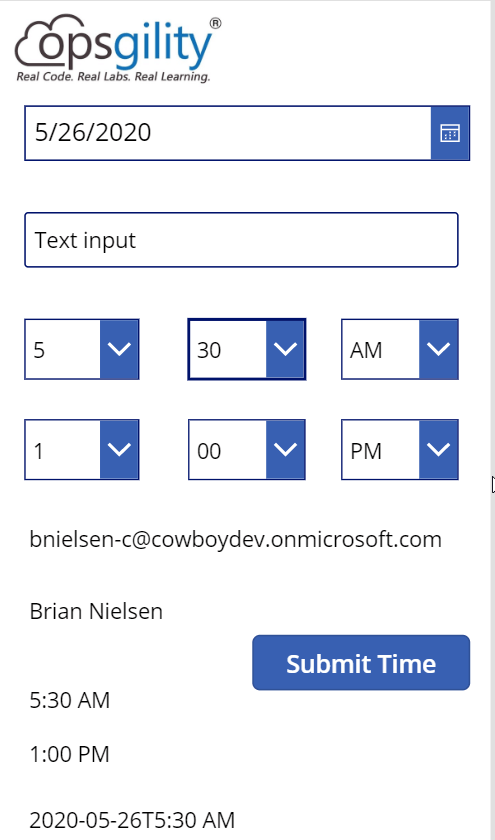
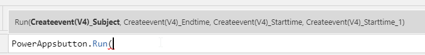
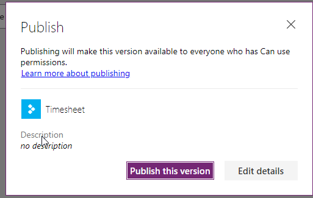
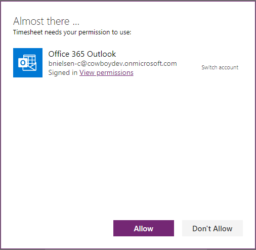

# Time sheet Challenge Guide

## Overview

<span class="colour" style="color:rgb(36, 41, 46)">In this challenge, you will be tasked to complete a variety of local and Azure challenges to setup a a Time sheet application. The end goal will be extending the application to utilize a PowerApp that front-line workers can utilize on a mobile phone to eliminate the need of sharing a computer to login to input time. </span>

## <span class="colour" style="color:rgb(36, 41, 46)">Accessing Microsoft Azure</span>

<span class="colour" style="color:rgb(36, 41, 46)">Launch Chrome from the virtual machine desktop and navigate to the URL below. Log in using the provided Azure lab credentials, which are available by clicking the cloud icon at the top of the Lab Player.</span>
<span class="colour" style="color:rgb(36, 41, 46)"></span>

```
https://powerapps.microsoft.com/en-us/
```

## Challenge 1: Hooking it all together

* Starting in the canvas from the previous challenge add one more label to the bottom of the page. We are now going to calculate a start date & time and a end date & time.
* To concatenate the start date into a value the calendar wants copy the following into the new label. This takes the selected date value and adds the time we built earlier. You can click the Play button in the upper-right hand corner and change the date & time to review the changes.    
```
Text(txtDate.SelectedDate, "[$-en-US]yyyy-mm-dd") & "T" & txtCalcStart
```  
  
* Close the preview with either the X in the upper right or clicking the ESC key  
* Click on the button one time to select. Change the Navigation to Action. Associate the PowerApps button flow to the button by selecting it  
  
* The Formula bar for the button is not highlighted and shows which values it is expecting and the order.  

* First we want to pass in the Subject which is the txtResponse.Text value. 
* Next is the End Time then the Start Time (Note: example has additional starttime_1. Should not appear in your environment). Copy the following into the button OnSelect event.
```
PowerAppsbutton.Run(txtResponse.Text,DateTimeValue(Text(txtDate.SelectedDate, "[$-en-US]yyyy-mm-dd") & "T" & txtCalcEnd),DateTimeValue(Text(txtDate.SelectedDate, "[$-en-US]yyyy-mm-dd") & "T" & txtCalcStart),DateTimeValue(Text(txtDate.SelectedDate, "[$-en-US]yyyy-mm-dd") & "T" & txtCalcStart))
``` 
* Save your changes CTRL-S
* Publish the new PowerApp for testing  

* Final Publish confirmation  

* Click on Open and select the Timesheet app previously built
* Confirm permission to use Outlook  

* Open a new tab and navigate to https://office.com 
* Click on Outlook
* Select Calendar
* Switch back to the Timesheet app
* Click the Play button in the upper right-hand corner
* Now click the *Submit Time* button
* Using the default values will create a 12 hour meeting from 1am to 1pm on the selected date  

* Finally let's clean up the application by adding some labels to the fields on the canvas and hide all the calculation fields at the bottom.


## Success criteria

* You should have at a basic PowerApp with all the automatically calculating values.

## Progressing to the Next Challenge

